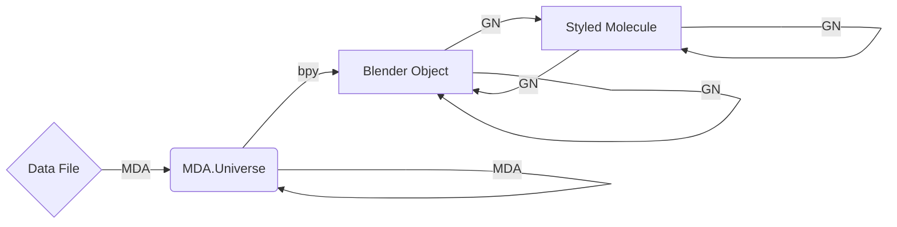

# Contributing to Molecular Nodes

## Table of Contents
- [Contributing to Molecular Nodes](#contributing-to-molecular-nodes)
  - [Table of Contents](#table-of-contents)
  - [Introduction](#introduction)
    - [Molecular Nodes Overview](#molecular-nodes-overview)
  - [Getting Started](#getting-started)
  - [Understanding Blender Add-ons](#understanding-blender-add-ons)
    - [`bpy`](#bpy)
    - [Creating a Basic Operator:](#creating-a-basic-operator)
  - [Project Structure](#project-structure)
    - [Import](#import)
    - [Manipulation](#manipulation)
  - [Coding Standards](#coding-standards)
  - [Submitting Changes](#submitting-changes)
  - [Building a Dev Environment](#building-a-dev-environment)
  - [Running Tests](#running-tests)
  - [Writing and Building Docs](#writing-and-building-docs)
  - [Getting Help](#getting-help)

## Introduction
Molecular Nodes is an add-on for the 3D modelling and animation program [Blender](https://blender.org). It enables import of structural biology data formats into Blender, and provides a suite of methods for interacting, animating and visualising this data.

The structure of Molecular Nodes is likely quite different to other python projects you may be familiar with, and different to other Blender add-ons as well. Some things are done in a particularly _quirky_ way, usually to be usable as an add-on inside of Blender.

Molecular Nodes is primarily an add-on, and intended to be interacted with through Blender's GUI. There is experimental support for installing and using as a python package from `pypi`. This is still extremely experimental, and again results in a lot of strange quirks as we are using a program intended for use through a GUI, through a script.

### Molecular Nodes Overview
There are a couple of distinct areas of Molecular Nodes to be aware of.

1. Reading, parsing and importing data formats
2. Visualising data through Geometry Nodes

Most of the 'scripting' side of things is for the first section of parsing the wide variety of structural biology data formats and importing them into Blender. The general idea is that we turn molecular structures into 3D models by turning each atom into a vertex, and each bond into an edge between vertices. Once this data is imported, Blender has a suite of tools for dealing with '3D models', which we can exploit to work on molecular models as well.

## Getting Started
Unfortunately `.blend` files are binary files to git, so the full repo size can be quite large when downloading the full history (~1GB). It's recommended to clone this repository using `git clone --depth 1` which greatly reduces the size of the download.

For writing code, I highly recommend using VSCode and the [Blender VS Code](https://github.com/JacquesLucke/blender_vscode) addon which streamlines the development process. It provides a range of commands for building and quickly refreshing the add-on during development, greatly speeding up the process.

> [!IMPORTANT]
> For the first time building, run the `build.py` to download and setup required packages for the first time.

`blender` is shorthand for the Blender executable. Depending on your OS and installation method, you may need to provide the full path to the Blender executable such as `/path/to/blender` or `C:\Path\To\blender.exe`.

Packages are sourced from the `uv.lock` file. To properly install inside of Blender we have to download the `.whl` files to `molecularnodes/wheels/` and ensure the `blender_manifest.toml` is up to date. This is all handled inside of the `build.py` script. There are options to just download (`--download-only`) or just build the `.zip` files (`--build-only`).

```py
blender -b -P build.py -- -help # show help for build.py
blender -b -P build.py -- -download-only # download required packages
blender -b -P build.py -- -build-only # build the .zip files
blender -b -P build.py # download and build
```

Once installed, you can use the `Blender: Build and Start` command with VS Code open in the addon directory, to start Blender with the addon built and installed. Any changes that are then made to the underlying addon code, can be quickly previewed inside of the running Blender by using the VS Code command `Blender: Reload Addons`.


## Understanding Blender Add-ons
The general idea with add-ons is that they provide new functionality to Blender, usually by adding new panels with buttons that execute custom python code. Blender ships with it's own Python kernel inside, allowing for essentially any arbitrary Python code to be executed.

Usually this is done through the creation of [`operators`](https://docs.blender.org/manual/en/latest/interface/operators.html). Think of operators as just Python code that is executed when a button is pressed inside of the GUI. All of the the buttons inside of Blender execute an operator when pressed, which then carries out the desired actions. The operators have support for taking into account the current state of the GUI, where the mouse is, what objects are available etc when executing the code.

We _can_ execute code without calling an operator, but this has to be done via the Python REPL inside of Blender. To create a useful add-on, we define the code we want to be executed, then create a related operator that can call the code when required.

Because operators take into account `context` and other aspects of the GUI when executing, they can be difficult to work with at times when trying to script without the GUI, like when trying to use Blender as a package inside of a Jupyter Notebook. To help with this problem, the general design of Molecular Nodes is to create a function which includes all of the code we want, then the associated operator only calls this function with the relevant parameters and does nothing else. That way we can get the same results as the operator while scripting, without having to deal with operators.

In the example add-on below, we can see the operator class being defined as a subclass of the `bpy.types.Operator` class. It will have a method called `execute(self, context)` which is what is called when a button is pressed in the add-on. We will have access to `context` information (where the mouse cursor is, what viewport we are in etc). You can include as much code as you wish inside of the `execute()` function, but like previously described the design with Molecular Nodes is to define the function elsewhere so it can be called more easily in another script, then have the operator just call the the function and report the success.

### `bpy`

In Blender add-on development, `import bpy` is your gateway to the Blender Python API. Anything that you can do via Blender's UI, you can usually achieve via calls to `bpy`.

```python
import bpy

bpy.data                        # Access all of the data blocks inside of Blender
bpy.data.objects                # access all of the objects in the scene by name

cube = bpy.data.objects['Cube'] # get the data block for an object in Blender
cube.data                       # the data associated with the cube, such as edges, vertices, faces
cube.data.attributes
cube.data.vertices

bpy.ops                         # all of the pre-defined operators inside of Blender

bpy.context                     # all of the global context values, i.e. different properties set in the UI
bpy.types                       # the different pre-defined types used through bpy
```

`bpy` exposes a wide range of classes and functions, enabling you to perform tasks like creating objects, applying materials, setting animations, and much more, all programmatically.

For example, `bpy.data` grants access to the data blocks within Blender, such as meshes, materials, and textures, while `bpy.ops` allows you to call operators to perform specific actions, like rendering an image or duplicating an object.

Until earlier this year, `bpy` was only available when running scripts from inside of Blender, but it is now a `pip` installable package, which helps us with running test suites and for potential integrations with Jupyter Notebooks and other scripting environments.

### Creating a Basic Operator:

In Blender, operators are actions that can be triggered by the user or other parts of the code. They can range from simple tasks like moving an object to complex operations like rendering an animation.

Operators can execute code of any arbitrary length. They can provide additional _context_ in the form of the `context` argument, which is given by Blender depending on where the operator is invoked. If you press a button in one window of Blender, it might do something different compared to a different window of Blender. Most of the operators inside of Molecular Nodes do not change their behaviour.

The design of Molecular Nodes is mostly to expose all of the functionality inside individual function calls. To download a protein from the PDB, import it to Blender and create starting style, you can use the `mn.load.molecular_rcsb()` function. Inside of the UI for Blender, when the user clicks the <kbd>Download from PDB</kbd> button, the operator just calls this function with the inputs taken from the local context, such as starting style and PDB code to download. The operators themselves should not be doing any kind of complex operations, as that functionality won't then be available for use via scripts.

Below is the minimum required to create an add-on for Blender. We define a custom function, create an operator that executes code (calling the function), we create some UI that displays a button to execute the operator, and we create `register()` and `unregister()` functions to install and uninstall the add-on.


```py
import bpy

def my_function():
    print("hello world!")

class SimpleOperator(bpy.types.Operator):
    bl_idname = "wm.simple_operator"
    bl_label = "Simple Operator"

    def execute(self, context):
        #code to be executed by the operator goes in the `execute()` function
        my_function()

        # operators inside of Blender return `{'FINISHED'}` to signal they have completed
        # correctly and Blender can return control of the program back to the user.
        # This is why they are useful for UI operations, but less useful for scripting
        # other potential returns are 'CANCELLED', 'RUNNING_MODAL', 'PASS_THROUGH'
        return {'FINISHED'}

# define a menu that will appear inside of the Blender's UI
# the layout function `layout.operator()` will take a string name of the operator,
# and create a button in the UI which will execute the operator when the buttons is pressed
def menu_func(self, context):
    # you can input either the string for the operator name, or take that
    # name from the class itself
    self.layout.operator(SimpleOperator.bl_idname)
    self.layout.operator("wm.simple_operator")


# The `register()` and `unregister()` functions are run whenever Blender loads the
# addon. This occurs the first time the add-on is installed and enabled, and then whenever
# Blender is started while the add-on is enabled. For Blender to be aware of the operator's
# existence, it has to be registered (and unregistered when uninstalled). The same has to
# happen for the UI components
def register():
    bpy.utils.register_class(SimpleOperator)
    bpy.types.VIEW3D_MT_mesh.append(menu_func)

def unregister():
    bpy.utils.unregister_class(SimpleOperator)
    bpy.types.VIEW3D_MT_mesh.remove(menu_func)
```

The `register()` and `unregister()` functions are two crucial components of a Blender add-on and have to be included. These functions are called when the add-on is enabled or disabled. They register all of the operators, UI elements and other necessary components with Blender when the add-on is enabled, and remove them all when it's disabled to ensure that you don't have a panel showing up for an add-on that isn't being used.

These functions are called automatically when using Blender via the GUI, but have to be manually called when scripting outside of Blender.

```py
import molecularnodes as mn
mn.register()
# other code here
```


## Project Structure

The way that data flows and is handled is unconventional, and likely different
to other python packages that you might have experience with.

There are two main components to the add-on, split into `Import` and
`Manipulation`. Depending on data format, the `import` is handled by a different python package. For downloading from the wwPDB and importing most local `.pdb` and `.cif` files, `biotite` is used. When importing a molecular dynamics trajectory.

All import methods result in a Blender object, and then the `Geometry Nodes` system inside of Blender manipulates and styles the imported 3D model.


### Import

Importing is the more traditional aspect of the add-on. With the help of several
python packages such as `biotite`, `MDAnalysis` and others, various molecular
data formats are parsed.

Once parsed, the data is turned into a 3D mesh, with a vertex for each atom and
an edge for each bond (if information available). Now inside Blender as a
'native' 3D mesh, Geometry Nodes handles all further manipulation of the data,
with additional animations, duplication, selections, and creation of new
geometry in the form of styles.

Below shows the potential flow of data, showing whether MDAnalysis (MDA),
Blender's python module (bpy) or Geometry Nodes (GN) are responsible for
handling that data. Once the data is parsed into a universe, MDA can select,
filter and do other operations on the topology and the trajectory of the
universe. While MDA can update the object inside of Blender by



### Manipulation

Manipulation is handled entirely by the Geometry Nodes (GN) system that exists
inside of Blender. Inside of Geometry Nodes, users can create node trees to
modify, animate and style their macromolecular structures, through a range of
pre-made node groups which are included inside of the add-on.

The nodes take the underlying atomic data, which is stored as a 3D mesh with
each vertex representing an atom, and each edge between those vertices
representing a bond (where applicable). Both the vertices and edges can store
arbitrary attributes, which we use to store the atomic information with the
atoms and bonds. Currently only numeric, boolean and vector attributes are
supported, but in the future strings and more complex attributes will also be
supported.

Interacting with the nodes via scripting is still quite difficult, the API on
this on Blender's side still needs a lot of improvements. So far the best
approach has been to 'manually' make the node groups inside of Blender, and then
save them and append the pre-made node groups from other `.blend` files to the
current working file. This isn't a fantastic strategy as the `.blend` files are
opaque to `git`, so we just need to rely upon tests for checking if something is
broken.

## Coding Standards
This project has already gone through several iterations to improve the general code base and the ability for others to contribute. It started as my (@bradyajohnston) first python project, so there is still lots of old code that could do with a refresh. It is slowly being improved to better fit PEP8 standards, but there are no official standards for the project currently. I welcome suggestions and discussion around the topic.

## Submitting Changes
Please open an issue or PR if you would like to discuss submitting changes. Support for importing more data formats or improving on current import formats are more than welcome. Submitting changes for node groups can be a bit tricky as the node graphs inside of Blender don't work with `git`, so please open an issue or discussion with proposed changes.


## Building a Dev Environment

Building a local development environment isn't required for building and running the add-on (this is handled by the Python that is shipped inside of Blender), but it _is_ required for [running tests](#running-tests) and [building docs](#writing-and-building-docs) locally.

Blender is _VERY PARTICULAR_ about python versions. Blender 4.1 now uses Python `3.11.X`. Blender 4.0 and some earlier versions use Python `3.10.X`.

### Building with `uv` (recommended)

I recommend using `uv` for managing your development environment(s).
Once you've [installed uv](https://docs.astral.sh/uv/#installation), the following steps will build a dev environment:

```bash
 uv sync --all-extras
```

Then [activate your environment](https://docs.astral.sh/uv/pip/environments/#using-a-virtual-environment) with:

```bash
source .venv/bin/activate
```

or prefix any further commands with `uv run`, e.g. `uv run pytest -v`.

> [!NOTE]
> For a reason I can't yet figure out, when using `uv` to run commands sometimes `biotite` loses track of some files. You may get errors related to CCD and running this cmomand will fix them:
>
> ```uv run python -m biotite.setup_ccd```

### Building with `conda` (or `mamba`) and `poetry`

You can also use `anaconda` or something similar (minimal options include [miniconda](https://www.anaconda.com/docs/getting-started/miniconda/main) and [micromamba](https://mamba.readthedocs.io/en/latest/user_guide/micromamba.html)) to manage python environments.

```bash
conda create -n mn python==3.11
conda activate mn
pip install poetry
poetry install --all-extras
```

Note that for both `uv` and `poetry`, in place of `--all-extras`, you can use `--extra test` or `--extra docs` to install only the optional dependencies you need for testing or docs building, respectively.

## Installing pre-commit hooks

Once you have a dev environment set up, install pre-commit hooks to ensure your code is properly formatted before committing
Activate the dev environment and run:

```
pre-commit install
```


## Running Tests

With [your dev environment](#building-a-dev-environment):

```bash
pytest -v # run with a more verbose output
pytest -v tests/test_load.py # run a single tests file
pytest -v -k centre # pattern match to 'centre' and only run tests with that in the name
```

Look over other tests to see how we are structuring them. Most of the tests will involve importing data, generating a 3D model and then creating a `snapshot` of the attributes for some subset of vertices from that 3D model.
We could snapshot _all_ of the vertices, but the snapshots are just `.txt` files so the diffs would become very large.
When changing something that _should_ change the output of the snapshots, we end up with _very_ large number of files changed.
Based on the current snapshot method, I can't think of of a better way to handle this.

## Writing and Building Docs

To build the documentation, [`Quarto`](https://quarto.org) is used. The docs can be built and previewed with the following line which launches a live preview of the docs.

The first time it previews the documentation all code will be executed, which includes rendering of 3D images so it can take several minutes to build the first time. Subsequent builds will be much faster as only changed code will be re-executed.

With [your dev environment](#building-a-dev-environment):

```bash
cd docs
python generate.py
quartodoc build
quartodoc interlinks
quarto preview
```

The long-form written documentation is all inside of `docs/`. Documentation is written in markdown (`.md`) or quarto-flavored markdown (`.qmd`) which allows to execute code when building the docs.

The documentation for individual nodes which are shown [here](https://bradyajohnston.github.io/MolecularNodes/nodes/) are built by running the `docs/generate.py`, which extracts information from the relevent `.blend` data files inside of `molecularnodes/assets/`. Combining the information for the input / output types & tooltips with the summaries described in `molecularnodes/ui/node_info.py` we can then generate nice HTML documentation for each of the nodes.

This isn't currently the best implementation for this. I would prefer to just pull from those nodes which are defined in the `.blend` file, but we aren't able to include descriptions for the node groups currently inside of the `.blend`. `node_info.py` is also used for building the add menus as well as the documentation. To update the descriptions of inputs, outputs and data types the nodes themselves need to be updated inside of the `.blend` files. Relevant example videos should be updated when nodes are changed.

## Getting Help
Please open an issue on the repo to ask questions relating to development or testing.
