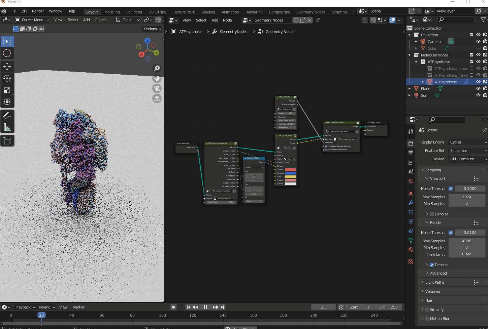
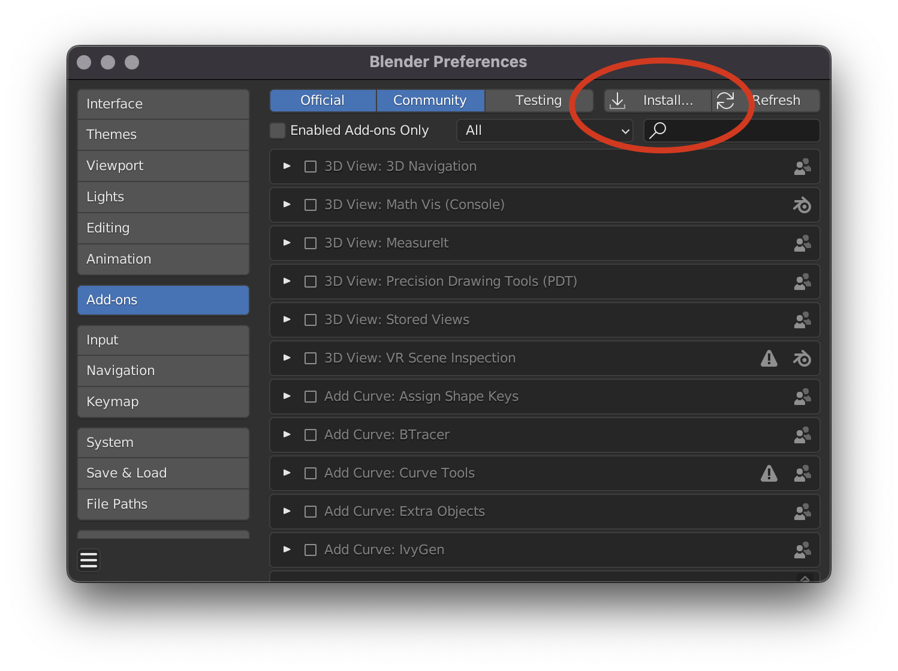
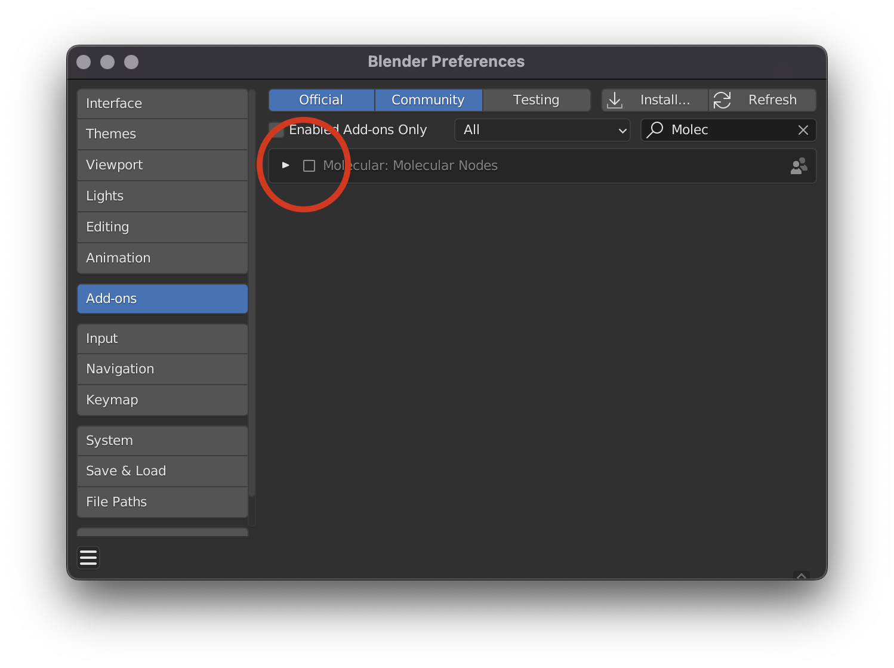
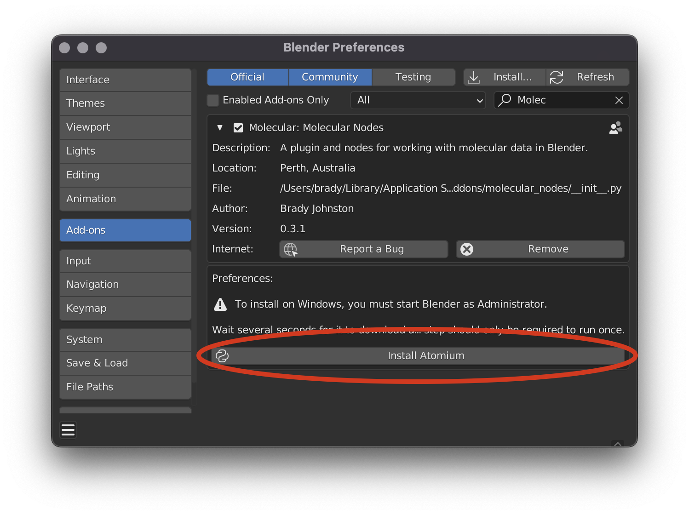
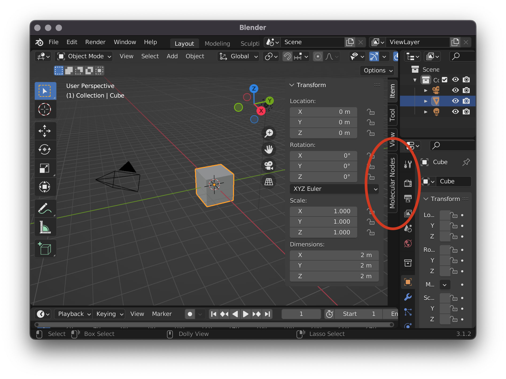
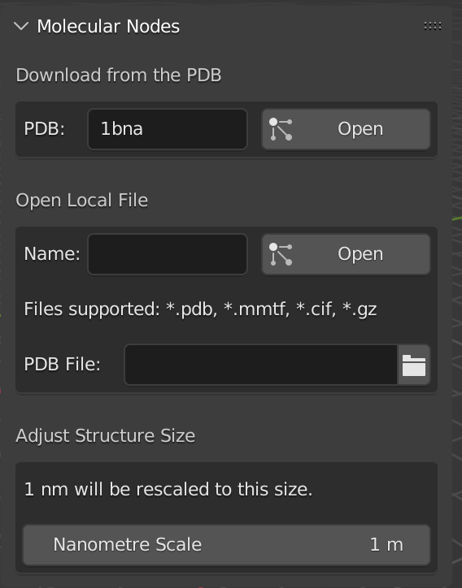

# Molecular Nodes

Molecular Nodes provides a convenient method for importing structural biology files into Blender, and several nodes for working with atomic data inside of Blender's Geometry Nodes.

Blender's Geometry Nodes provides a powerful interface for procedural modelling and animation. Currently it is limited in its ability to read any kind of structured data file as input, that isn't a 3D mesh. Molecular Nodes bridges this gap by providing an interface for converting `.pdb` and other file types into meshes that are usable by Geometry Nodes.

## Installation

To install Molecular Nodes, download the [latest release](https://github.com/BradyAJohnston/MolecularNodes/releases) and install the addon through the preferences panel inside of Blender, and select the `MolecularNodes_0.3.4.zip` file
> Edit -> Preferences -> Addons -> Install

If the addon isn't highlighted, search for it and click the tick box to enable the addon.

### Installing Atomium
> Windows: You must run Blender as Administrator to be able to install Atomium successfully.

While still in the preferences panel, click the `Install Atomium` button to download and install the [Atomium python library](https://github.com/samirelanduk/atomium). 

The addon should now be enabled and available for use. 

## Loading Structures
You can load structures using the Molecular Nodes panel, which should be available at the top-right of the 3D viewport. You can press `N` to show & hide the side panels. Click on the `Molecular Nodes` tab to reveal the panel.

Molecular Noes provides two ways to open files. You can fetch directly from the PDB by inputting the 4-character code into the top box and pressing the download button. This will download the file and open it inside of Blender.

You can also open a file saved on your local computer. Click the folder icon to navigate to your `.pdb` file, select it and press OK. Then press `Open` on the Molecular Nodes panel to read the file and load the model into Blender.

## Using the Nodes

### Atomic Properties
With Molecular Nodes enabled, create a geometry nodes node tree, and inside the add menu (`Shift + A') there will be an additional category for Molecular Nodes. 

To access the atomic properties that are associated with the model, add the "Atomic Properties" node from `Properties -> Atomic Properties` and in the node, select the `*_properties` collection. This will scale the points according to their Atomic Radii, and make all of the atomic properties associated with the atoms (atomic number, is_backbone / is_sidechain) available for use inside of the node tree.

### Styling

To quickly colour the structure, add the "Style Colour" node from `Styling -> Style Colour`, select a material for the atoms, and connect the `atomic_number` from the `Properties` node to the `atomic_number` of the style node. The outputted colour becomes an output for the node tree.

Name the output for the node tree in the modifier tab: 

And add an attribute node to the shader, inputting the name for the colour output fromt the GN node tree, in this case `colour`. 

### Voila!
> By default, the atoms are 'point clouds' and only visible inside of Cycles. 

The atoms should now be visible, inside of the Cycles render engine: 

To make the atoms visible inside of EEVEE, use the `Styling -> Atoms EEVEE` node. You will need to create and assign a material for each element individually.

## Animating Frames
To animate between frames of a `.pdb` file, add the `Animate Frames` node from `Animation -> Animate Frames` and choose the `*_frames` collection to give the model the infomation of the different structures. You can now animate between the frames by using the `Animate 0...1` slider which will animate between the first frame (`0`) and the last frame (`1`). Attach the `Animate Node` from `Animation -> Animate` to automatically play through the frames.

You can now play back the animation!

In the example below, I create the `.pdb` frames from [this tweet](https://twitter.com/UCSFChimeraX/status/1258888093068701696?s=20&t=zDVE14P-Q6HfHJtnJpsKSw) and imported them with the steps above, and added a `Random Vector` based on the chain number, to colour the carbons of the different chains different colours.

