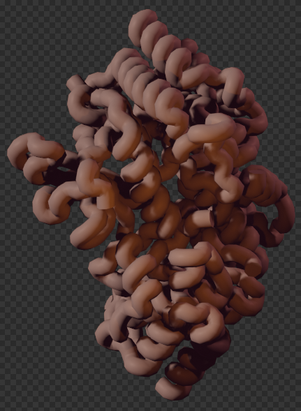
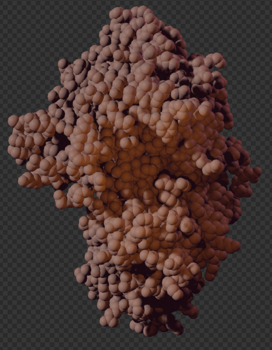
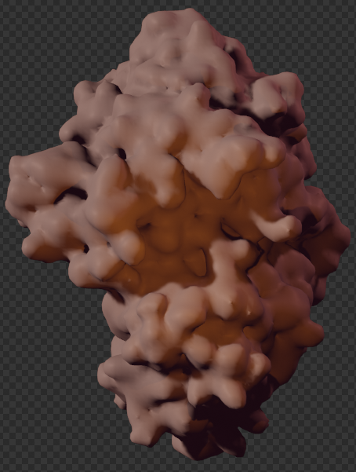
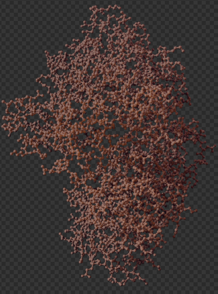
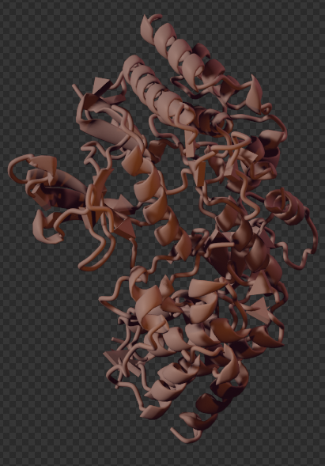
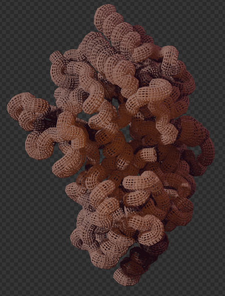

# Nodes

## Original Setup

When importing a PDB structure, you get a set of interconnected nodes, of which two belong to this addon.

The MOL_style_color taking for input the geometry, meaning atom coordinates and properties (visible in the top left corner of your blender window). It allows different colors to be assigned based on the value of the atom type attribute. The output is a mesh of vertices (atoms) connected by edges (bonds) that can be converted to a curve.

You are free to modify this setup as you wish using the *Shift+A* shortcut and going to the Molecular Nodes tab, which contains a set of nodes detailed thouroughly here. 

## Properties

### Atomic Properties

The `MOL_prop_setup` node associates all of the different atomic properties with their corresponding atoms in the structure.

#### Required Inputs

-   **Atoms:** mesh vertices or point-cloud that are the `XYZ` locations of the atoms.

-   **Properties Collections:** The collection that contains the `NAME_properties_1` models that were imported alongside the structure.

#### Optional Inputs:

A boolean switch for each of the atomic properties.
By default the properties are enabled, but they can be disable if required to provide a slight performance improvement if not required.

#### Outputs

-   **Atoms (**mesh vertices or point-cloud)**:** that are the `XYZ` locations of the atoms, that also have *named attributes* for each of the atomic properties that were selected for set up.

-   **atomic_number** (integer field): integer number corresponding to the atomic number of the atom.
    Defaults to 0 if *atomic_number* cannot be determined.

-   **chain_number** (integer field): integer number corresponding to the chain that the atom belongs to.
    Chains will be sorted into alphabetical order, then given a corresponding integer number starting from 1.
    Defaults to 0 if *chain_number* cannot be determined.

-   **atom_name_number** (integer field): integer number corresponding to the name of the atom within the structure ("CA" for the alpha carbon).
    Defaults to 0 if *atom_name_number* cannot be determined.

-   **AA_sequence_number** (integer field): integer number corresponding to the sequence number of the amino acid in the structure that the atom belongs to.
    For LYS32 the *AA_sequence_number* will be 32.
    Defaults to 0 if *AA_sequence_number* cannot be determined.

-   **AA_name** (integer field): integer number corresponding to the different residue names.
    Amino acids are numbered 1-20 based on alphabetical order.
    See the `MOL_sel_AA_name` node for the corresponding order.

-   **atom_index** (integer field): integer number corresponding to the order of the atom within the structure file.

-   **B_factor** (float field): a float number corresponding to the value that was present in the B factor column, also known as the *temperature factor*.

-   **is_backbone** (boolean field): a boolean value (TRUE or FALSE, 1 or 0) as to whether or not the atom is part of the backbone of the protein.

-   **is_alpha_carbon** (boolean field): a boolean value (TRUE or FALSE, 1 or 0) as to whether or not the atom is an *alpha carbon* of the amino acid.

{fig-align="center"}

For the next two node categories, a selection can be set using either random/noise values, or an attribute inherent to the atoms, listed above. The styling and coloring nodes will then affect chosen atoms.

## Styling Nodes

### Style Ribbon

This node uses the `is_alpha_carbon` property and the `chain_number` properties to generate a ribbon-representation of the structure as a mesh.
Options are available for the radius, smoothness and the resolution of the ribbon.

#### Required Inputs

-   **Atoms** (mesh vertices or point cloud): atoms that contain at least the *is_alpha_carbon* named attribute and the *chain_number* attribute to ensure the ribbons are separated by chain.

#### Outputs

-   **Ribbon** (mesh): a mesh that is the ribbon representation of the structure.

-   **Curve** (spline / curve): a curve that goes through all of the alpha carbons in the structure, that is used to build the final ribbon mesh.

### Style Atoms

This node represents atom coordinates as point clouds (cycles, unrealized geometry) or icospheres (eevee, real geometry). Both can be set to have different radii and the eevee one can be set to a different sphere resolution.

#### Required Inputs

-   **Atoms** (mesh vertices or point cloud): atoms that include the *vdw_radii* attribute.

#### Outputs

-   **Atoms** : Visible spheres per instances of input atoms, depending on the render engine.

### Style Surface

This node represents the computed surface of the molecule, based on atom coordinates. The quality involves direct subdivision, for a richer geometry, scale radii boosts the influence of each atomon the rendered surface, probe size adds details, surface smoothing reshapes final geometry by blurring, thus averaging, positions.

#### Required Inputs

-   **Atoms** (mesh vertices or point cloud): atoms that include the *vdw_radii* attribute.

#### Outputs

-   **Surface** : Actual geometry surrounding the atoms.

-   **Volume** : Blender instance of volume density inside of the computed surface. Can be used to scatter points again, or with a specific shader.

### Style Ball and Stick

This node represents the usual molecular representation of molecules, with atoms as a ball and bonds as sticks. Both radii andresolution can be modified.

#### Required Inputs

-   **Atoms** (mesh vertices or point cloud): atoms that include the *vdw_radii*, *bond_types*, *pre_bond_index*, *atomic_number*, *res_name*, *chain_id*, *res_id* attributes.

#### Outputs

-   **Sticks** : Atom bonds visualised as a straight curve.

-   **Balls** : Atoms visualised as spheres.

-   **Ball and Stick Mesh** : The combination of the outputs shown above.

### Style Cartoon

The highly anticipated update :O

This node represents a common modern illustration of proteins, with alpha helix as a planar corskrew shape, and beta sheet as a stretched cuboid with a triangle-shaped polygon at the end, constituting an arrow.

Representations of helixes can be switched between corkskrew and cylinder, and each shape can be scaled and smoothed using either resolution or subdivisions.

Parameters can be changed locally using geometry nodes, see examples in the documentation/examples.md, and combined with other representations using Join Geometry.

#### Required Inputs

-   **Atoms** (mesh vertices or point cloud): atoms that include the *is_alpha_carbon* attribute.

#### Outputs

-   **Mesh** : Geometry containing the secondary structure representations.

### Preview

After each style node there is a preview of the default settings on a protein. You can combine further reprensentations to style it as you wish (which combination of nodes is the following representation?)

## Coloring Nodes

### Set Color

#### Required Inputs

-   **Atoms** : Defining geometry.

#### Outputs

-   **Atoms** : selected atoms are colored.

### Goodsell Color

#### Outputs

- **Color** : Outputs colors on a scale depending on the *atomic_number* attribute of the atom.

### Color By

#### Required Inputs

-   **Atoms** : Atoms that include the necessary attribute (example : *atomic_number* for Color by Atomic Number node).

#### Outputs

-   **Atoms** : selected atoms are colored depending on the choosen attribute.

## Density Nodes

Its roles are akin to the styling nodes, differing only on the inputs.

### Style Surface (Density)

#### Required Inputs

-   **Volume** : A blender volume object that can be generated by the Style Surface (Atoms) Node.

#### Outputs

-   **Geometry** : generated sampled surface in the shape of a mesh corresponding to the volume input, keeping only the *Color* attribute.

### Style Wire (Density)

#### Required Inputs

-   **Volume** : A blender volume object that can be generated by the Style Surface (Atoms) Node.

#### Outputs

-   **Geometry** : generated sampled surface represented as intertwined wires corresponding to the volume input, keeping only the *Color* attribute.

### Sample Nearest Attribute

#### Required Inputs

-   **Atoms** (mesh vertices or point cloud): atoms that include the *Color*, *b_factor*, *atomic_number*, *res_name*, *chain_number*, *res_id* attributes.

#### Outputs

-   **Color** : The color attribute of the selected input atoms.

-   **b-factor** : The b-factor attribute of the selected input atoms.

-   **atomic_number** : The atomic_number attribute of the selected input atoms.

-   **chain_number** : The chain_number attribute of the selected input atoms.

-   **res_id** : The res_id attribute of the selected input atoms.

-   **res_name** : The res_name  attribute of the selected input atoms.

## Bonds Nodes

### Find Bonds

#### Required Inputs

-   **Atoms** (mesh vertices or point cloud): atoms that include the *Color*, *b_factor*, *atomic_number*, *res_name*, *chain_id*, *res_id*, *vdw_radii* attributes.

#### Outputs

-   **Atoms** : Input atom instances with bonds corresponding to icosphere points distributed around each atoms and with distance inside of the *Scale Radius*.

### Break Bonds

#### Required Inputs

-   **Atoms** (mesh vertices or point cloud): atoms composed of bonded geometry.

#### Outputs

-   **Atoms** : Input atom instances with the resulting bonds with length inside of the *Distance Cutoff* attribute value.

### Find Bonded atoms

#### Required Inputs

-   **Selection** : selected atoms composed of bonded geometry.

#### Outputs

-   **Selection + Bonded** : The input selected atoms in addition to the closely detected atoms linked to it.

-   **Bonded** : closely detected atoms with active bond shared with selected atoms.

## Selection Nodes

### Select Atoms

#### Required Inputs

-   **Atoms** (mesh vertices or point cloud): atom geometry.

#### Outputs

-   **Selected Atoms** : Atom geometry corresponding to the input selection.

-   **Inverted Atoms** : Atoms of the input goemtry not corresponding to the selection.

-   **Pre-Sel.Index** : *Index* attribute of the input atoms.

### Separate Polymers

Uses the *res_name* attribute as integer coding to determine which part of the structure is part of canonical biomolecules. Only cover nucleic and amino acids for now.

#### Required Inputs

-   **Atoms** (mesh vertices or point cloud): Atoms with *res_name* attribute.

#### Outputs

-   **Protein** : Atoms corresponding to the residues part of the 20 common amino acids.

-   **DNA** : Atoms corresponding to double-stranded or desoxyribo nucleic acids.

-   **RNA** : Atoms corresponding to single-stranded or ribo nucleic acids.

-   **Other** : Atoms flagged as exotic residues.

### Chain Select

Uses the *chain_id* attribute to generate atom selection.

#### Outputs

-   **Selection** : Atom selection corresponding to chosen chains.

-   **Inverted** : Atom selection opposite from the above.

### Ligand Select

Uses the *res_name* attribute to generate atom selection.

#### Outputs

-   **Selection** : Atom selection corresponding to chosen ligand.

-   **Inverted** : Atom selection opposite from the above.

### Backbone Select

Uses the *atom_name* attribute to generate atom selection.

#### Outputs

-   *is_alpha_carbon* : Atom selection for CA.

-   *is_backbone* : Atom selection for CA, C, O and N.

-   *is_side_chain* : Atom selection for side chain of residues.

### Atom Properties

Uses *is_alpha_carbon*, *is_backbone*, *is_peptide*, *is_nuleic*, *is_solvent*, *is_carb* attributes in combination to generate exclusive selections.

### Atomic Number

Uses *atomic_number* attribute to select a specific type of atom. Equal to the Z parameter in the periodic table (or proton composition of a nucleus).

### Element Name

Similar to the node above, lays out the most common biological atomic components with name and coding for selection.

### Distance-Based Selection

Both Distance and Slice Nodes work the same way, the inputs are foregin objects, and the outputs are selections for the geometry of the molecule imported with Molecular Nodes (aka the information for a specific geometry nodes modifier). In Blender, objects used for constraints and animations are often Empties, objects with no visual instance used to influence other objects' properties.

Distance returns the value of the distance between your molecule and the selected object, as well as what's inside and outside the Scale Cutoff as an atom selection.

Slice looks at the position of another object and outputs selections for the molecule based on XYZ axis.

### Select Residues

Uses the *res_id* attribute to generate a selection based on the enumeration ID of residues in the molecuel.

Composed of the two possibilities, Res Single and Res Range, referencing the selection of a single residue or sevral contiguous at once.

### Name Selection

Uses the *res_name* attribute to generate selection for either amino acids or nucleic acids.

### Res Whole

Lets you add the whole molecule selection to the input one (or generates it if no input).

### Res Atom

Lets you select specific types of atoms in the backbone and whole backbone or sidechains.

## Animate Nodes

To replicate trajectories, all the states/frames are loaded in as an object in a collection, and these nodes allow for frame interpolation.

For most of the nodes of this category, it is important to place the origin of the geometry in the right place.

Positions are actualised temporally based on random values or noise, and the *Animate 0..1* value drives the progress of the animation, it can be either fed animation value, or it can be keyframed by Blender internal tools.

The Wiggle scales with the *b_factor* attribute, and the Curve redistributes input atoms along the instanced profile curve of choice (will be done relative to coordinates, this is why geometry origin is especially important to get right).

## Assemblies Nodes

When the PDB file imported contains information about Biological Assemblies (i.e. superstructure polymer for a protein, for example virus capsid), these information can be called upon to realize the assemblies and center them.

## DNA Nodes

When a DNA object is imported, a curve will follow the general path of helix and bases will be instanced in the prim_DNA collection.

### Double Helix

#### Required Inputs

-   **Curve** : input curve where the helix is generated.

-   **Bases** : dNTPs in a collection that are instaced on the helix.

#### Outputs

-   **Base Instances** : Rotated instances that can be realized on a curve with Instance on Points (pick instance).

-   **Helix Curve** : The guiding curve for nucleic bases (can be treated as a "Points" distribution".)

### Bases Node 

Picks base instances from the prim_DNA colection generated on import or on node instancing and colors them.

### Styling

Works essentially the same as for Styling nodes described above, just for bases instead of residues.

## Utilities

Nodes used inside other nodes of this addon to facilitate geometry manipulation.
