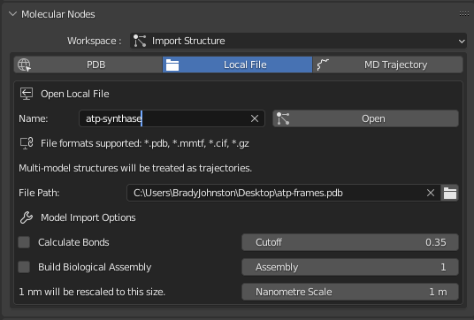
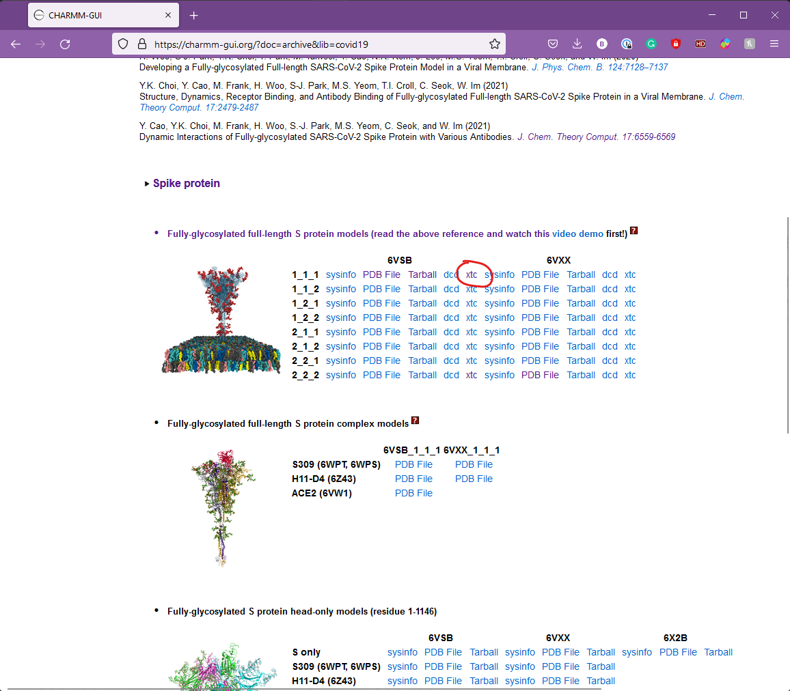
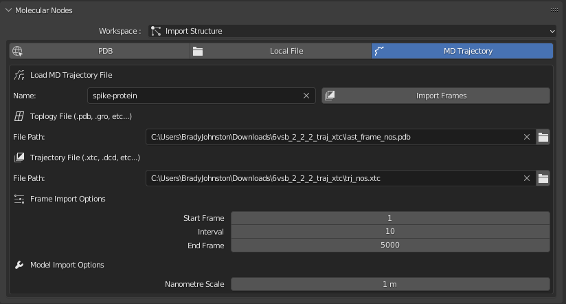

# Animating ATP Synthase


To create the animation of ATP synthase you can morph between separate states of ATP synthase and export them from your favourite molecular graphics program.
In this example, we will use ChimeraX.

Use the following code in ChimeraX's console to import and create a morph between the 3 different protein conformations that will create the animation:

``` html
open 6n2y 6n2z 6n30
morph #1,2,3 wrap true
```

You can now play back the animation inside of ChimeraX.

To save the animation as a multi-pdb file, use the following code to save the `.pdb` file:

``` html
save atp-frames.pdb #4 allCoordsets true
```

You can now open the multi-frame pdb file inside of Molecular Nodes using the 'Open Local File' tab.



This example is taken directly from the ChimeraX twitter account:

<blockquote class="twitter-tweet">

<p lang="en" dir="ltr">

To morph between 3 conformations of ATP synthase use ChimeraX commands "open 6n2y 6n2z 6n30" and "morph #1,2,3 wrap true".
<a href="https://twitter.com/hashtag/ChimeraXHowTo?src=hash&amp;ref_src=twsrc%5Etfw">#ChimeraXHowTo</a> <a href="https://t.co/2u4Au6Tvpf">pic.twitter.com/2u4Au6Tvpf</a>

</p>

--- ChimeraX (@UCSFChimeraX) <a href="https://twitter.com/UCSFChimeraX/status/1258888093068701696?ref_src=twsrc%5Etfw">May 8, 2020</a>

</blockquote>

```{=html}
<script async src="https://platform.twitter.com/widgets.js" charset="utf-8"></script>
```
# Animating COVID Spike Protein

::: callout-caution
## Requires MDAnalysis Installed

To follow this particular tutorial, ensure you have first [installed Molecular Nodes properly](installation.md), including the optional MDAnalysis python package.
:::

Download the trajectory files from the the [CHARMM-GUI website](https://charmm-gui.org/?doc=archive&lib=covid19):

You will want to download the `.xtc` files for the spike protein in membrane.

::: callout-caution
The .xtc file will be large, \~2GB so the download may take a while.
:::



Unzip the files (you may need to unzip the unzipped file) and then inside of Molecular Nodes, in the MD Trajectory tab, select the tpology file (`last_frame_nos.pdb`) and the trajectory file (`trj_nos.xtc`).\
\
Give the molecule a name, and your panel should look like this:



## Frames to Import

In the frame import options, we can choose which frames from the trajectory to import.
Importing every frame (`interval = 1` ) will take long time to load, and balloon-out the save-file size of the `.blend` file.
It's best to work with some subset of the trajectory frames, and interpolate between them with Molecular Nodes.\

::: callout-note
Molecular nodes is still surprisingly performant with thousands of frames loaded, but the `.blend` file takes a long time to save and load due to several GBs worth of data being save and loaded each time.
:::

For this example we are going to import every 10th frame.

## Click 'Import Frames' and Wait

Molecular Nodes is working through a lot of data, so this load step can take a few minutes - be patient.
Once it's all loaded, the structure along with the atomic properties are available for use inside of Geometry Nodes!

## Click space to play the animation.

Ensure to change over to `Cycles` & `rendered view` to view the coloured atoms, but otherwise the animation should be playing if press `space`!

*Just Points*


*Rendered View* In this scene I additionally added a Sun light.


## Geometry Nodes

Now that the animation is imported into geometry nodes, you can work with the points as you would otherwise.

Try applying some noise, or in this example, scaling the points to `0` based on the proximity to an empty.


