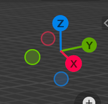
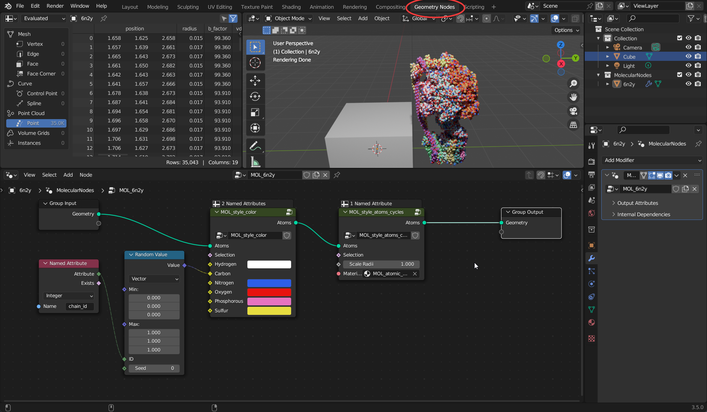
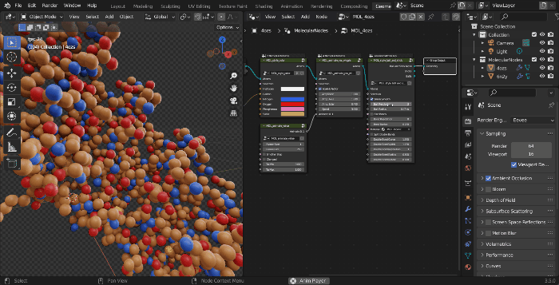

This is a very basic introduction to Molecular Nodes. How to import a protein from the PDB & change the colour and style via editing the node graph. Molecular Nodes and Geometry Nodes in general has a lot more advanced functionality, and I encourage you to watch other YouTube tutorials and spend time playing around with it to see what is possible. Everything that I have achieved so far is through playing around to see what could be done.

::: callout-ip
## YouTube Tutorials

I have also made a series of YouTube tutorials walking through some of the functionality of Molecular Nodes. Currently this tutorial series is for the older version of Molecular Nodes and not the 2.0 version. The basic functionality and idea remain the same, but I will be updating this series once I get enough time.

<iframe width="560" height="315" src="https://www.youtube.com/embed/CvmFaRVmZRU" title="YouTube video player" frameborder="0" allow="accelerometer; autoplay; clipboard-write; encrypted-media; gyroscope; picture-in-picture" allowfullscreen>

</iframe>
:::

## The MolecularNodes Panel

1.  Click on the `Scene Properties` panel, which will show the `MolecularNodes` panel, which has the buttons and options for downloading and importing protein structures.
2.  Enter your PDB ID of choice and click on download. This will import the molecular data into Blender, and you will see a new object appear in the Outliner (top right) under the MolecularNodes collection.

The structure is now imported into the scene. While initially the structure will appear as grey points, this is because Blender has a 3D view for working, then a Rendered view for actually rendering with calculated lighting.

## Rendered View

1.  Click the 'Render Properties' tab, which has the icon for the back of a camera.
2.  Change the render engine from EEVEE to Cycles.
3.  Change the render device from CPU to GPU if applicable. Some computers may not have GPU compute available.
4.  Change the view to rendered view, which will calculate the lighting for the scene and show all of the atoms.

## The Grid and Axes

This 3D viewport will seem familiar if you have used other programs such as PyMol, ChimeraX & VMD. You can move the camera around just like in those other programs.

You can rotate the camera view either using the middle mouse button <kbd>MMB</kbd>, or using your touch pad if you are on a laptop. You can also click and drag the axis widget to rotate the camera.

You can pan the camera using <kbd>Shift</kbd> + <kbd>MMB</kbd>

The main difference is that you can also manipulate the 3D scene in front of you. You can select objects with a left click of the mouse, and move them around by *Grabbing* them with the <kbd>G</kbd> key.

The main actions that you use the 3D Viewport for are:\

-   <kbd>G</kbd> - **Grabbing:** Moving an object around in 3D space.

-   <kbd>S</kbd> - **Scaling:** Changing the relative size of an object.

-   <kbd>R</kbd> - **Rotating:** Rotating the object in 3D space.

In the 3D viewport, much like in real life, there are 3 axes of possible movement and direction. Inside of Blender they are `X` `Y` and `Z`. `X` and `Y` form the flat grid that you see in the viewport, being coloured TODO red and green respectively, while `Z` is the blue vertical axis. These are labelled and highlighted on the axis widget, which is present in the top right corner of the viewport. This will rotate as you rotate the view, so it can always be used as a reference point.

{fig-align="center"}

## Geometry Nodes Editor

This is where we edit the node graph for Molecular Nodes. The node graph is a program you create, that is read and executed by Blender from left to right. Each node performs an action on the geometry that is passed into it, and the result of that action is passed out to the right.

> Think of it as creating a set of rules for the computer to follow. You define the rules, and the computer can follow those same rules, even if you start with a different data set.

Combining multiple different nodes you can create protein models and complex 3D scenes. In the example below, there is a node tree which should be present on every new structure imported via MolecularNodes. The atoms and bonds are passed in from the left, the atoms are given a colour based on their element and their `chain_id`, and then the atoms are styled as atoms, scaling the atom radii to `1.00`.

The starting style `MOL_style_atoms_cycles` is only visible via inside of the Cycles render engine. You can add other styles manipulate the data through other nodes, by adding them with <kbd>Shift</kbd> + <kbd>A</kbd> and navigating to the MolecularNodes panel at the bottom. There are several categories of nodes for different animations and styles. You can add the `Ribbon Protein` node, which will create a ribbon representation based on the alpha carbons in the structure. If there is not colour in the structure, ensure that the node has a material `MOL_atomic_material` at the bottom of the node.

## Quick Animations

There are many ways to quickly create animations inside of Blender and MolecularNodes. One such way is to use the `Wiggle` node inside of MolecularNodes. This wiggles the amino acid side chains, based on their experimentally-determined B-factor, to give life to the structure. Crystral structures are ultimately static snapshots of a dynamic system, and this is a quick way to bring some of those dynamics back to the structure.

{fig-alt="A gif showing amino acids wiggling and moving about as part of a protein cystral structure. Their movement is scaled based on their experimentally determined B-factor."}

{fig-alt="A screenshot of some geometry nodes inside of Blender. The major nodes pictured are 'MOL_style_colour', 'MOL_animate_res_wiggle' and 'MOL_style_ball_and_stick' which result in an animation of amino acids wiggling about inside of a protein structure."}