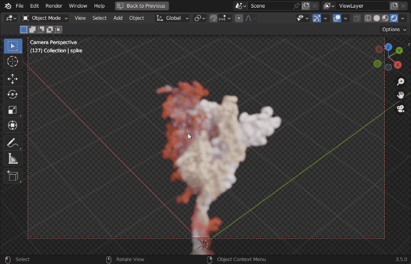

Molecular Nodes (MN) is an addon for the 3D modelling & animation program [Blender](https://blender.org).
MN enables easy import of molecular data such as `.pdb` & `.mmCIF`, along with a variety of molecular dynamics trajectories and topologies from a variety of simulation sources. Other data formats including electron microscopy (EM) `.map`, EM tomography files such as `.map` and `.star`, with the potential to support more data formats as well.

Molecular Nodes provides the translation layer that allows importing of molecular data formats, while Blender provides the industry-leading animation and rendering tools to create visually stunning molecular graphics with ease.

The add-on runs on the [Geometry Nodes](https://docs.blender.org/manual/en/latest/modeling/geometry_nodes/introduction.html) procedural modelling and animation system inside of Blender, which gives the add-on speed and robustness with minimal user input required.

|Procedural Animations|Different Stylings|MD Trajectories|
|---|---| --- |
|{width="400px"}|||
|EM Density maps|`.star` mapbacks| |
| || |

## Molecular Nodes in the Wild

Below will feature some examples of Molecular Nodes being used in videos, from around the internet.

#### Veritasium 
<iframe width="560" height="315" src="https://www.youtube.com/embed/8DBhTXM_Br4?si=1nGRkAwJk6LJJQhy&amp;start=1650" title="YouTube video player" frameborder="0" allow="accelerometer; autoplay; clipboard-write; encrypted-media; gyroscope; picture-in-picture; web-share" allowfullscreen></iframe>

#### Nano Rooms
<iframe width="560" height="315" src="https://www.youtube.com/embed/elRbbdJUiTU?si=7_17weJxhCVQGl3W" title="YouTube video player" frameborder="0" allow="accelerometer; autoplay; clipboard-write; encrypted-media; gyroscope; picture-in-picture; web-share" allowfullscreen></iframe> <iframe width="560" height="315" src="https://www.youtube.com/embed/0luZ4JqHg6w?si=i74Ia0yrIKYO_7Jw" title="YouTube video player" frameborder="0" allow="accelerometer; autoplay; clipboard-write; encrypted-media; gyroscope; picture-in-picture; web-share" allowfullscreen></iframe>

#### St. Jude Children's Research Hospital 

[{align="left"}](https://awards.ami.org/gallery/WOVQRGgD/LrVXNAor?search=848d592b94f65998-20)

## Getting Started

To get started, checkout the [installation page](#installation) for detailed instructions on how to install the add-on. Next check out some of the tutorials, such as [intro to blender](tutorials/00_interface.md), [basics of downloading](tutorials/01_importing.qmd) from the PDB or how to [customise selections](tutorials/02_selections.md).

There are some _slightly outdate_ tutorials on YouTube about how to use the add-on also. MN has been developed further and improved since these videos, but the general workflow remains the same.

::: center
<iframe width="560" height="315" src="https://www.youtube.com/embed/CvmFaRVmZRU" title="YouTube video player" frameborder="0" allow="accelerometer; autoplay; clipboard-write; encrypted-media; gyroscope; picture-in-picture" allowfullscreen>

</iframe>
:::

