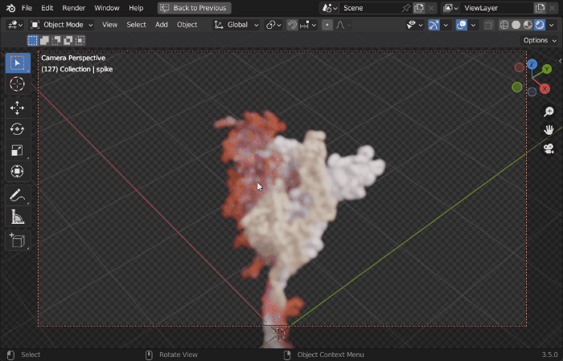

Molecular Nodes (MN) is an addon for the 3D modelling & animation program [Blender](https://blender.org).
MN enables easy import of molecular data such as `.pdb` & `.mmCIF`, along with a variety of molecular dynamics trajectories and topologies from a variety of simulation sources. Other data formats including electron microscopy (EM) `.map`, EM tomography files such as `.map` and `.star`, with the potential to support more data formats as well.

Molecular Nodes provides the translation layer that allows importing of molecular data formats, while Blender provides the industry-leading animation and rendering tools to create visually stunning molecular graphics with ease.

The add-on runs on the [Geometry Nodes](https://docs.blender.org/manual/en/latest/modeling/geometry_nodes/introduction.html) procedural modelling and animation system inside of Blender, which gives the add-on speed and robustness with minimal user input required.

## Getting Started Tutorials

::: center
<iframe width="560" height="315" src="https://www.youtube.com/embed/CvmFaRVmZRU" title="YouTube video player" frameborder="0" allow="accelerometer; autoplay; clipboard-write; encrypted-media; gyroscope; picture-in-picture" allowfullscreen>

</iframe>
:::

