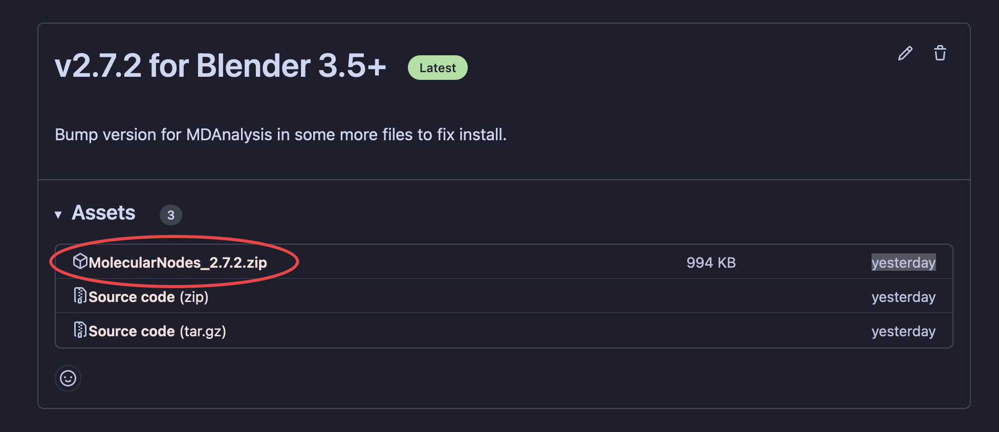
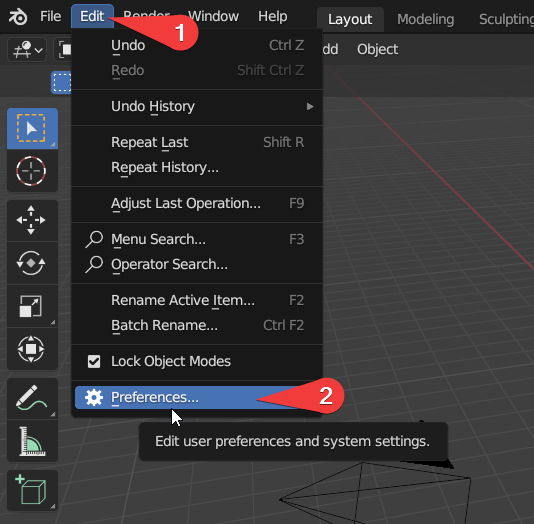
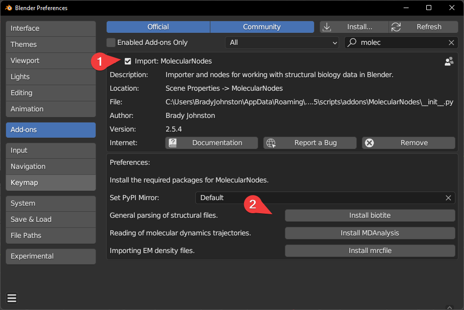

## Downloading MolecularNodes

Download the latest bundled release from the [releases page](https://github.com/BradyAJohnston/MolecularNodes/releases/). Don't download the GitHub repo itself, as this won't install inside of Blender.

::: callout-note
# Safari

When downloading on MacOS with Safari, it automatically unzips the file into a `MolecularNodes` folder. This is extremely unhelpful as Blender requires the `.zip` file to install the addon. Either download with a different browser, or compress the folder again to `MolecularNodes.zip`.
:::

[{fig-alt="Screenshot of the MolecularNodes releases page on Github, with the relevant download link circled in red."}](https://github.com/BradyAJohnston/MolecularNodes/releases/)

## Installing the Addon

::: callout-warning
### Windows Administrator

If you are on Windows, you may need to run Blender as Administrator to successfully complete the following installation.
:::

#### Open Preferences Panel

> Click \`Edit' -\> 'Preferences' or press <kbd>Cmd</kbd> + <kbd> ,</kbd> on Mac.



#### Click 'Install' while in 'Add-ons'


#### Select `MolecularNodes_X.zip`

> The `X`'s will be the current version number of the add-on.

## Installing `Biotite` & `MDAnalysis`

To import different data formats, different python packages are required to be installed. Each python package is responsible for importing a different data format.

-   `Biotite`: handles the majority of `.pdb` / `.cif` file parsing and downloading from the wwPDB.

-   `MDAnalysis`: enables import of molecular dynamics trajectories from programs such as GROMACS / LAMMPS.

-   `mrcfile`: enables import of electron microscopy densities and EM tomography `.map` files.

Each of these packages should be fine to be installed by a single click. Blender will freeze for potentially a minute or so during installation. Currently M1 / M2 macs require more complex installation to install `MDAnalysis`, please see the instructions below. Downloading from the wwPDB and opening local `.pdb` files with `Biotite` should work fine without `MDAnalysis` installed.

::: {.callout-warning collapse="true"}
## MacOS M1 & M2

Blender's bundled python is unable to install python packages that require compilation on the user's machine. Currently, MDAnalysis is missing a pre-compiled `.whl` to install, and thus installation will fail on M1 & M2 machines. You can download and pre-compile these packages on your machine yourself, following the below instructions.

This is the current fix for M1 / M2 machines, but will be fixed in [future releases](https://github.com/BradyAJohnston/MolecularNodes/issues/108#issuecomment-1467914853).

In short:

1.  Install [miniconda](https://docs.conda.io/en/latest/miniconda.html)
2.  Download and build the required packages for your system

``` bash
mkdir ~/MDAnalysis-wheel
cd MDAnalysis-wheel
conda create -n wheel-builder python=3.10 cython
conda activate wheel-builder
python -m pip wheel MDAnalysis==2.5.0 --cache-dir .
conda deactivate
```

3.  Install the built `.whl` packages, into Blender's bundled python. The path to your

Navigate to your Blender's python folder (this is the default path for Blender 3.5)

``` bash
cd /Applications/Blender.app/Contents/Resources/3.5/python/bin/
```

Install the cached `.whl` into the bundled python that came with Blender.

``` bash
./python3.10 -m pip install MDAnalysis --cache-dir ~/MDAnalysis-wheel
```

The <kbd>Install MDAnalysis</kbd> button should now successfully install the remaining packages.
:::



A message should report the successful installation of each package, with the button changing to <kbd>Reinstall biotite</kbd> once MolecularNodes detects the successful installation of the package.

You may need to restart Blender after package installation for them to work properly.

If you have troubled with installation, search through the [issues page](https://github.com/BradyAJohnston/MolecularNodes/issues) for a potential solution. If you can't find the solution there, please open a new issue on the GitHub page. Please don't just DM or email me directly. It's better to do problem solving out in the open, as others might have the same issue or someone other than me may already have a solution!

# Start Importing Structures!

Molecular nodes should be fully installed. See the [Getting Started](getting-started.md) page on how to start importing into Blender!