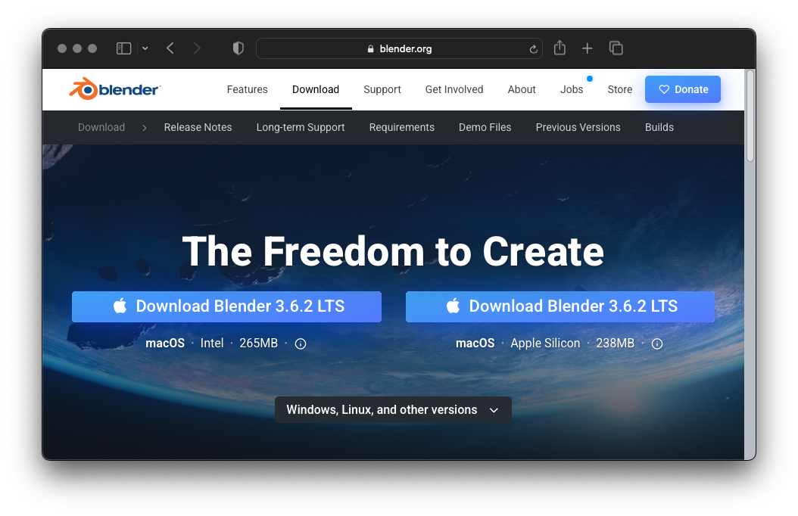
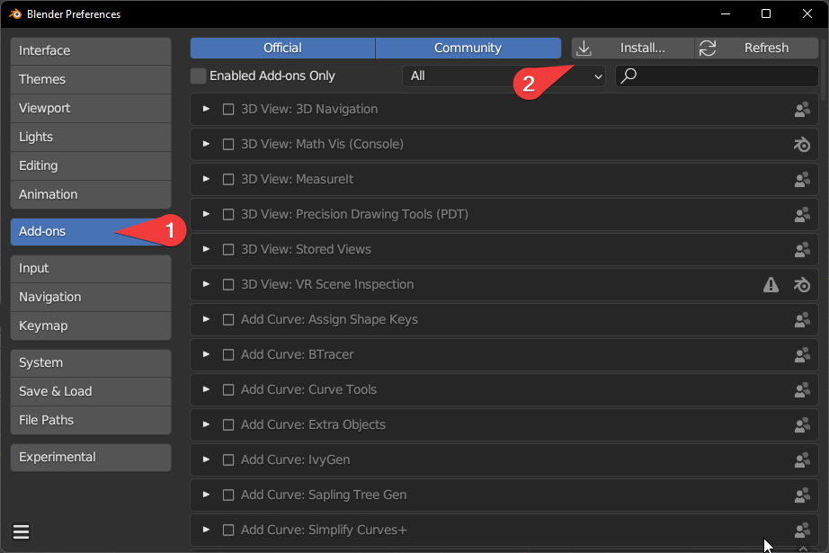

::: callout-warning
# Versions
Molecular Nodes now has version numbers that match the Blender version it is targetted to work with.

Molecular Nodes will `4.0.X` will work with Blender `4.0`. When Blender is updated to `4.1`, Molecular Nodes will start start using `4.1.X` for releases that work with that version.

Blender also has minor version numbers (such as `4.0.1` but these will not affect the compatibility with Molecular Nodes, and you should just download the latest version.)

Molecular nodes will usually work with higher versions of Blender, but will not work with earlier versions. If you get errors during installation or using the software, double check the versions you are using of each.
:::

## Downloading Blender

Molecular Nodes is an add-on for the 3D animation program Blender. It runs inside of Blender, so the first step for installation is to [download and install](https://www.blender.org/download/) the latest version of blender.

{align="center" width="800px"}

## Downloading Molecular Nodes

Download the latest bundled release from the [releases page](https://github.com/BradyAJohnston/MolecularNodes/releases/). Don't download the GitHub repo itself, as this won't install inside of Blender.

::: callout-note
# Safari

When downloading on MacOS with Safari, it automatically unzips the file into a `MolecularNodes` folder. This is extremely unhelpful as Blender requires the `.zip` file to install the addon. Either download with a different browser, or compress the folder again to `MolecularNodes.zip`.
:::

[{fig-alt="Screenshot of the Molecular Nodes releases page on Github, with the relevant download link circled in red." width="700px" align="center"}](https://github.com/BradyAJohnston/MolecularNodes/releases/)

## Installing the Addon

Follow the screenshots below to install the add-on. These steps should be the same across platforms.

::: callout-warning
### Windows Administrator

If you are on Windows, you may need to run Blender as Administrator to successfully complete the following installation.
:::

### Open Preferences Panel

> Click \`Edit' -\> 'Preferences' or press <kbd>Cmd</kbd> + <kbd> ,</kbd> on Mac.

### Click 'Install' while in 'Add-ons'

Select `molecularnodes_X.X.X.zip`. The `X`'s will be the current version number of the add-on.

## Installing Additional Python Packages

To import different molecular data formats, additional python packages are required. These will be installed into the python that comes with Blender. 

To get started downloading from the PDB, you only require the `biotite` package. Each package will give a brief description of what it is used for, and display version information once installed.

A message should report the successful installation of each package, with the button changing to <kbd>Reinstall biotite</kbd> once Molecular Nodes detects the successful installation of the package.

You may need to restart Blender after package installation for them to work properly.

If you have troubled with installation, search through the [issues page](https://github.com/BradyAJohnston/MolecularNodes/issues) for a potential solution. If you can't find the solution there, please open a new issue on the GitHub page. Please don't just DM or email me directly. It's better to do problem solving out in the open, as others might have the same issue or someone other than me may already have a solution!

## Start Importing Structures!

Molecular nodes should be fully installed. See the [Getting Started](tutorials/01_importing.qmd) page on how to start importing into Blender!