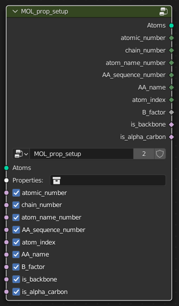
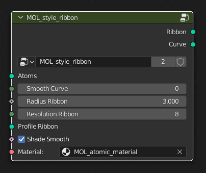

# Nodes

## Properties

### Atomic Properties

The `MOL_prop_setup` node associates all of the different atomic properties with their corresponding atoms in the structure.

#### Required Inputs

-   **Atoms:** mesh vertices or point-cloud that are the `XYZ` locations of the atoms.

-   **Properties Collections:** The collection that contains the `NAME_properties_1` models that were imported alongside the structure.

#### Optional Inputs:

A boolean switch for each of the atomic properties.
By default the properties are enabled, but they can be disable if required to provide a slight performance improvement if not required.

#### Outputs

-   **Atoms (**mesh vertices or point-cloud)**:** that are the `XYZ` locations of the atoms, that also have *named attributes* for each of the atomic properties that were selected for set up.

-   **atomic_number** (integer field): integer number corresponding to the atomic number of the atom.
    Defaults to 0 if *atomic_number* cannot be determined.

-   **chain_number** (integer field): integer number corresponding to the chain that the atom belongs to.
    Chains will be sorted into alphabetical order, then given a corresponding integer number starting from 1.
    Defaults to 0 if *chain_number* cannot be determined.

-   **atom_name_number** (integer field): integer number corresponding to the name of the atom within the structure ("CA" for the alpha carbon).
    Defaults to 0 if *atom_name_number* cannot be determined.

-   **AA_sequence_number** (integer field): integer number corresponding to the sequence number of the amino acid in the structure that the atom belongs to.
    For LYS32 the *AA_sequence_number* will be 32.
    Defaults to 0 if *AA_sequence_number* cannot be determined.

-   **AA_name** (integer field): integer number corresponding to the different residue names.
    Amino acids are numbered 1-20 based on alphabetical order.
    See the `MOL_sel_AA_name` node for the corresponding order.

-   **atom_index** (integer field): integer number corresponding to the order of the atom within the structure file.

-   **B_factor** (float field): a float number corresponding to the value that was present in the B factor column, also known as the *temperature factor*.

-   **is_backbone** (boolean field): a boolean value (TRUE or FALSE, 1 or 0) as to whether or not the atom is part of the backbone of the protein.

-   **is_alpha_carbon** (boolean field): a boolean value (TRUE or FALSE, 1 or 0) as to whether or not the atom is an *alpha carbon* of the amino acid.

{fig-align="center"}

## Styling Nodes

### Style Ribbon

This node uses the `is_alpha_carbon` property and the `chain_number` properties to generate a ribbon-representation of the structure as a mesh.
Options are available for the radius, smoothness and the resolution of the ribbon.

#### Required Inputs

-   **Atoms** (mesh vertices or point cloud): atoms that contain at least the *is_alpha_carbon* named attribute and the *chain_number* attribute to ensure the ribbons are separated by chain.

#### Outputs

-   **Ribbon** (mesh): a mesh that is the ribbon representation of the structure.

-   **Curve** (spline / curve): a curve that goes through all of the alpha carbons in the structure, that is used to build the final ribbon mesh.

{fig-align="center"}
