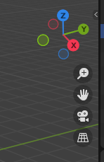
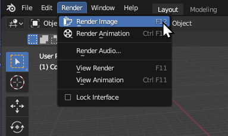
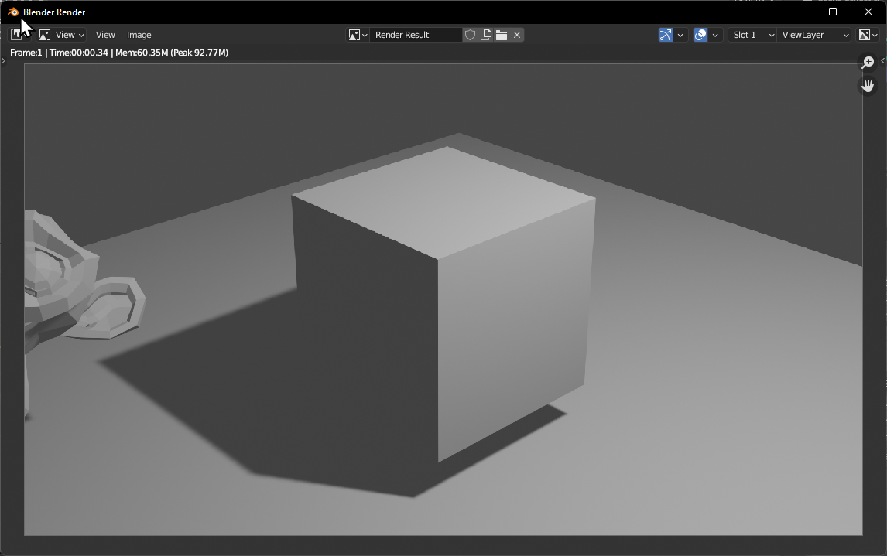
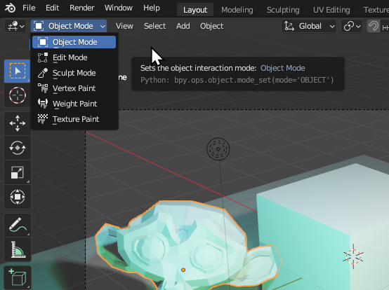

Blender has a _very_ overwhelming interface. There is no getting around this. Blender can do _practically anything_, and it is sometimes hard to do simple things.

### A New File

Starting a new file, you are greeted by the splash screen. You can click `General` to start a new session with a general-purpose setup.

This 3D viewport will seem familiar if you have used other programs such as PyMol, ChimeraX & VMD. You can move the camera around just like in those other programs.

In the 3D viewport, much like in real life, there are three (3) axes of possible movement and direction. Inside Blender are `X`, `Y`, and `Z`. The floor is made of  `X` and `Y`, which form the flat grid you see in the viewport coloured red and green/yellow, while `Z` is the blue vertical axis. These are labelled and highlighted on the axis widget, which is present in the top right corner of the viewport. This will rotate as you rotate the view, so it can always be used as a reference point.

You can rotate the camera view either using the middle mouse button <kbd>MMB</kbd> or using your touchpad if you are on a laptop. You can also click and drag the axis widget to rotate the camera.

You can pan the camera using <kbd>Shift</kbd> + <kbd>MMB</kbd>

## Transforming Objects

The main difference is that you can also manipulate the 3D scene in front of you. You can select objects with a left click of the mouse <kbd>LMB</kbd>, and move them around by *Grabbing* them with the <kbd>G</kbd> key.

The main actions that you use the 3D Viewport for are:\

-   <kbd>G</kbd> - **Grabbing:** Moving an object around in 3D space.

-   <kbd>S</kbd> - **Scaling:** Changing the relative size of an object.

-   <kbd>R</kbd> - **Rotating:** Rotating the object in 3D space.

### Locking to an Axis

When transforming by grabbing, rotating or scaling, you can lock the transformation to a particular axis. Click <kbd>X</kbd> / <kbd>Y</kbd> / <kbd>Z</kbd> after starting the transformation to lock it to those axes, or <kbd>Shift</kbd> + <kbd>X</kbd> / <kbd>Y</kbd> / <kbd>Z</kbd> to lock the transformation to be *perpendicular* to that axis.

## Rendered View

By default you start in `3D View`, which is characterised by everything being gray and not rendered properly.

You can change to the different views via the render view buttons, or by holding <kbd>Z</kbd> and selecting one of the options.

Each of the views are useful in their own way. If you have a powerful enough computer, you can spend the majority of your time in either `Rendered` or `Material Preview` view which will ensure everything is shaded and lighting is calculated. If a scene is becoming complex and your computer is slow, you can switch back to `3D View` which should improve performance.

## Rendering Engines

Already there are different ways to view the scene, through the 'rendered view' and the other methods. Even with the option of rendered view, there are multiple different rendering engines. Two rendering engines come pre-installed with Blender, with the possibility to use more. The two rendering engines that come pre-installed are Eevee and Cycles. By default Eevee is enabled, but you can change to Cycles in the `Render Properties` tab.

Eevee is much faster and more responsive than Cycles, but a lot of the time doesn't 'look as nice'. Eevee is a real-time rendering engine built for performance and interactivity, while Cycles is a path-traced rendering engine built for physically accurate light calculations. This is much slower to calculate but often results in 'nicer' lighting. Both rendering engines are excellent and are helpful in different scenarios depending on the desired outcomes.

The default style `Atoms Cycles` inside of Molecular Nodes is only visible inside of Cycles for performance reasons. All other styles are visible inside of both rendering engines. If your atoms seem to be invisible, check the rendering engine and style that you are using.

> If you have the option available, ensure to switch to `GPU Compute` instead of `CPU` when using the Cycles render engine. This will usually always be the better option, and the perforamnce will be much better.

## Adding Objects

You can add new objects by <kbd>Shift</kbd> + <kbd>A</kbd> or by using the `Add` menu in the top left.

There are a number of different object types that can be added. The most common that you will use will be `Mesh` and `Light`. Try adding some new objects, _**G**rabbing_ them to move them around, _**R**otating_ them and _**S**caling_ them to different sizes. If you have just added a new object and it isn't immediately visible, it might be inside another object, or it could be *too big* or *too small* to be immediately visible. Try moving the camera or the object around to get a better view.

## Rendering an Image

To render an image, you can click <kbd>F12</kbd> or use the `Render -> Render Image` menu. Blender will not render what you are immediately seeing. Instead, it will render whatever the **Camera**** is seeing. This can be frustrating at first, but it makes sense when you can have multiple cameras in a single scene.

To see what the camera sees, you can click the Camera widget in the top right, or click backtick (<kbd>`</kbd>) + <kbd>1</kbd>. 

> The backtick is directly under the <kdb>Esc</kbd> key on most American / Enlgish keyboards. It can vary in other language layouts.

Once you are happy with the camera framing, click render.

A window should appear, showing the rendered image. Isn't it magnificent?

The rendered image is not saved. You have to manually save the image by clicking `Image` -> `Save As` and choose where to save the image.

## Add More Lights

We can make our 3D scene more interesting by adding more lights. When the light object is selected, the green `Light Settings` tab becomes available, appearing as a small green lightbulb. Under these settings, we can change the colour of our light, along with the `Power`. Try tweaking these settings to your liking. You can duplicate an object without adding a new one by clicking <kbd>Shift</kbd> + <kbd>D</kbd>.

## Materials

One of the hardest things to get used to while working in 3D is the idea of materials. What if we want to make the monkey head **Red**? In 3D we can't just _make things red_. Instead we have to assign it a _material_. This material can have the property that it is primarily red, but it is also metallic, has a sheen, reflects light, can be partially transparent as well as a whole range of other properties.

Complex shading is an entire career itself, so we won't get too much in to it. In this example we will just add a material to the monkey to make it red, and a different material to the cube to make it blue.

> If you can't see the colors changing, ensure you are in Rendered view.

In the example below, we create a _new material_ called `Material.001` for the monkey which we change to red. The cube already has a material called `Material`. We change the material being used to the monkey's material, before changing it back and editing the starting material so that it is blue.

Try playing around with some of the other material settings, to see what effects you can create.

## Edit Mode

The last thing to be aware of when working inside of a 3D program like Blender, is that you can manually edit the 3D objects that are inside of the scene. In the top left hand corner of the 3D viewport. With an object selected, you can change between the different modes. You can edit the physical shape of a mesh, by moving individual or groups of vertices, by going into `Edit Mode`. You can also use the keyboard shortcut <kbd>Tab</kbd>

With a mesh object selected, you can change in to edit mode. While in edit mode, different options are available to you, and you can phsyically edit the mesh. Try selecting some vertices of the mesh and moving them around individually.

You now know the _very basics_ of adding new objects, changing the materials, adding some lights and rendering an image. The same principles apply to everything that you you do in Blender, and often all of the different workspaces will contain similar keyboard shortcuts and ways of working. Try playing around some more inside of the 3D scene, rendering some different 3D images, before moving on to the section which includes actual proteins.

Most things are best learnt by doing, so load some proteins in and try to follow along with the other tutorials.

