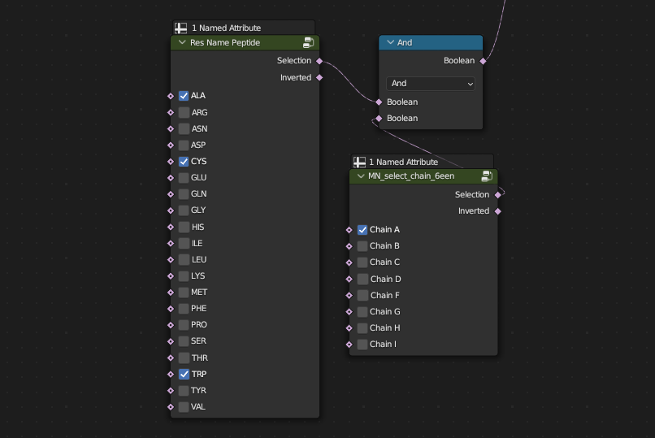
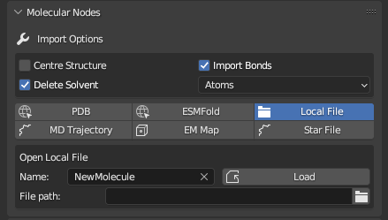
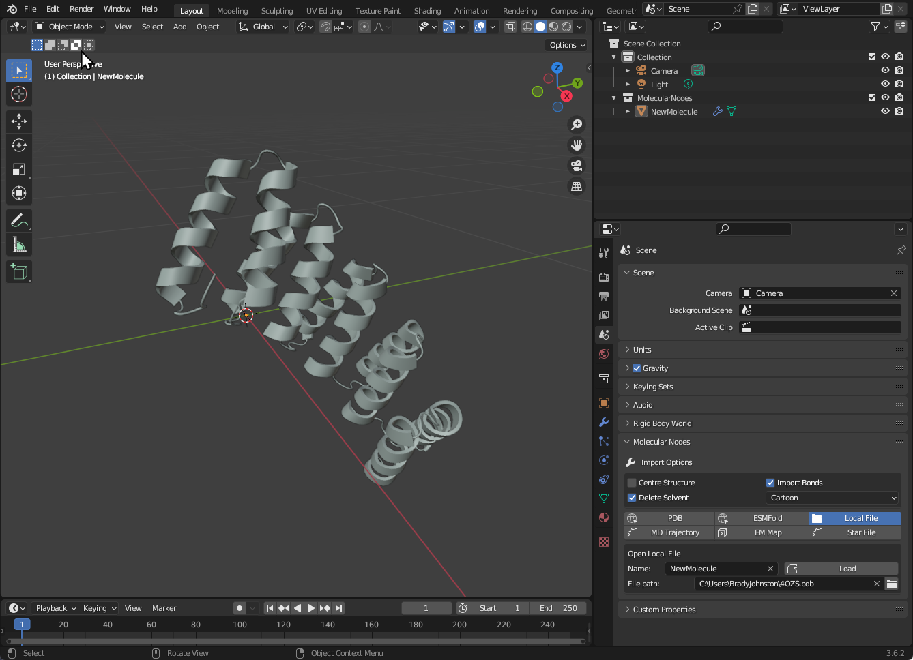

Selections power every part of Molecular Visualisation. You are probably used to using selections via manually pointing and clicking with your mouse, or typing long strings of complex selection algebra.

## A Simple Example

To create a selection of residues ALA, CYS and TRP, only inside of chain A, you would use the following code inside of PyMol:

```python
select my_selection, chain A and (resn ALA+CYS+TRP)
```

Inside of Molecular Nodes, you combine different selection nodes using `Boolean Math` nodes to create increasingly complex selections.



This might initially seem quite verbose. The good thing however is that these selections can always be updated and tweaked. They can even be created procedurally based on the values of other selections or animations. 

In the example video below we are using the selection to apply the `Atoms` style. We can change the residues and chains that are selected by ticking and unticking the boxes. Each of these selections also take a _field_ input, so they can use the output of other selection nodes.  The selections from the two nodes are being combined with the `Boolean Math` node set to `And`. Other boolean math operations are also available.


## Different Styles Combined

In this example, we apply the `Surface` style to one chain, and the `Atoms` style to another chain. We can join the two styles together with the `Join Geometry` node.


## Combining Selections

Selections can be combined not just through `Boolean Math` nodes, but also by connecting the output from one node to the input of another selection. In this example we are selecting two chains for applying the `Atoms` style to. 

The selection of `Chain A` we then control though the `Cube` selection node. The addition of this node creates a new object called `Empty_Cube` which we can transform by Grabbing, Rotating and Scaling to change what is inside of the cube. The style is then applied to the updated selection, which varies for `Cahin A` but not for `Chain F`.


## More Examples

You can use these dynamic selections for any kind of boolean input. It can be used to select the atoms to apply a style to or even to change different aspects of that style itself.  In this example, we first choose the atoms to apply the style to; then instead, we change whether or not we use cylinders for the cartoon style.


Selecting based on the `entity_id`, to reveal the rotary axel of the protein complex underneath.


## Open a Local File

To open a `.pdb`, `.mmCIF`, `.pdbx` or other similar files, use the <kbd>Local File</kbd> tab.

You can set the name for the molecule, which will become the object's name once imported. Use the folder icon to select the file you would like to import.



The 'Default Style' was changed to 'Cartoon', but no other default import options were changed. The Default Cube was deleted with <kbd>X</kbd> as the protein was imported *inside* of the cube.

