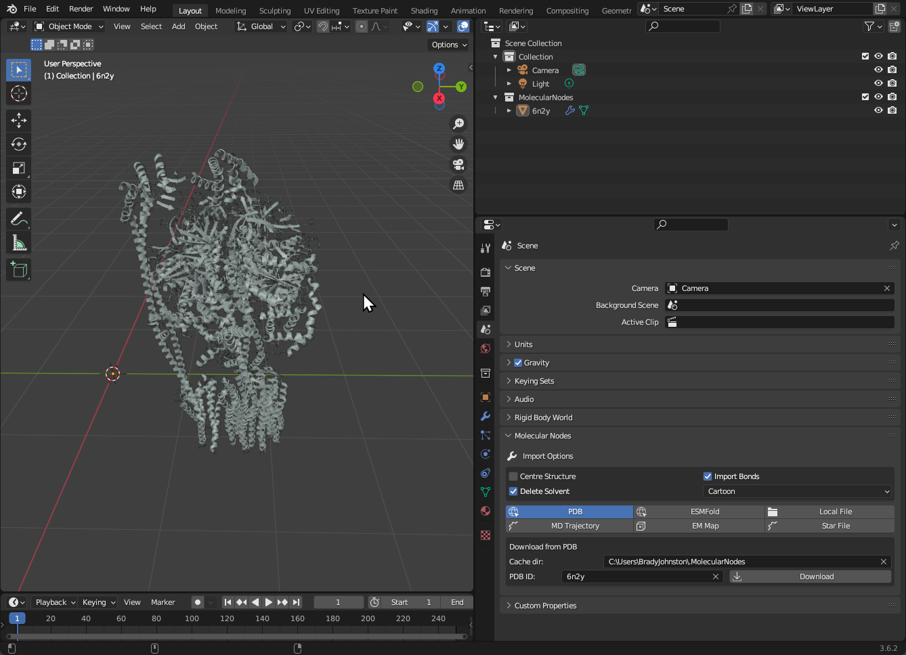

In the example below, `6n2y` was downloaded, with the `Cartoon` starting style selected. No other default settings were changed.

## Open a Local File

To open a `.pdb`, `.mmCIF`, `.pdbx` or other similar files, use the <kbd>Local File</kbd> tab.

You can set the name for the molecule, which will become the object's name once imported. Use the folder icon to select the file you would like to import.

The 'Default Style' was changed to 'Cartoon', but no other default import options were changed. The Default Cube was deleted with <kbd>X</kbd> as the protein was imported *inside* of the cube.

