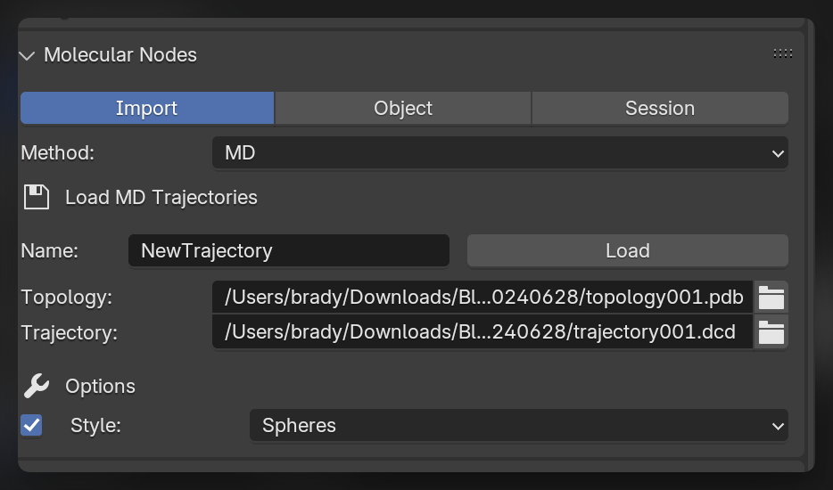
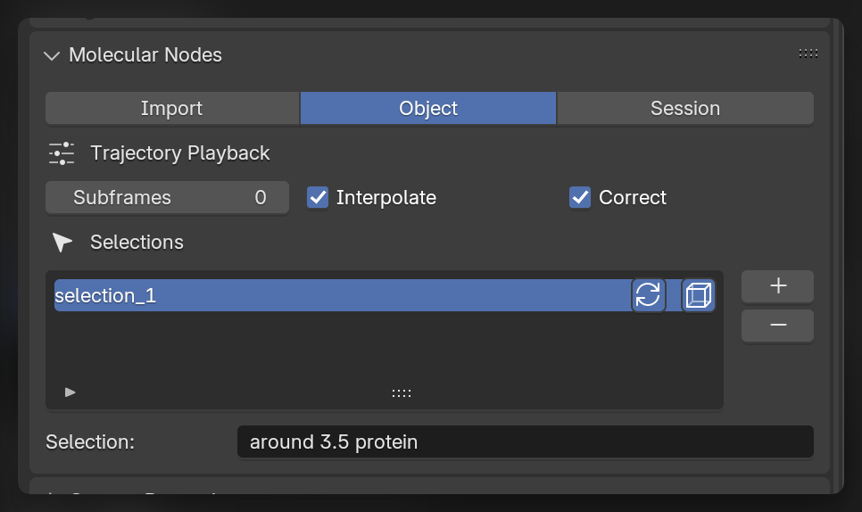

::: {#fig-md-example-render}
{autoplay="true" loop="true"}

The protein adenylate kinase (AdK) undergoes a structural change during its catalytic cycle between a closed and an open state that is captured in enhanced sampling simulations [@seyler2015].
The protein secondary structure is shown as a round ribbon with individual amino acid sidechains as ball-and-sticks.
The trajectory was rendered with Blender and the MolecularNodes plugin (Brady Johnston).
Trajectory files are available via [MDAnalysisData](https://www.mdanalysis.org/MDAnalysisData/adk_transitions.html#adk-dims-transitions-ensemble-dataset) Copyright CC-BY 2023 Brady Johnston.
:::

As well as importing static structures, the results from molecular dynamics simulations can be imported as models in to Blender.
This is enabled through the excellent package [`MDAnalysis`](https://www.mdanalysis.org/).
The imported structure will have an object created that will act as the topology file, and a connection is maintained the underlying `MDAnalysis.Universe` object that provides coordinates and allows for dynamic calculations to be performed during playback.

::: callout-warning
## Saving the File

When saving the `.blend` file, a corresponding `.MNSession` file will be saved next to your Blender file.
When reloading the file, the `MDAnalysis.Universe` will be reloaded from this file, so ensure you keep it next to the `.blend` file.
:::

## MD Trajectory Panel

To import trajectories, change the import method in the Molecular Nodes panel to the `MD` method.
To import a trajectory, select the topology and trajectory files.
You can choose the initial starting style, but this can easily be changed after import.

{width="500px"}

## Import the Trajectory

Click `Load` to import the selected trajectory with the chosen options.
The model will appear in the scene, and when the `Frame` changes inside of Blender, the corresponding frame will be displayed from the imported trajectory.

### Changing Style

To change which style is displayed, you have to interact with the *Geometry Nodes*,you use the same Geometry Nodes tree that you use for other structures.
Adding new style nodes and specifying their selections to limit limit the style to particular selections of atoms.

### Subframes

By default each frame on Blender's timeline corresponds to the frame in the imported trajectory.
You can increase the `Subframes` number for this trajectory, and the selected number of frames will be created in between the frames of the loaded trajectory.
If Interpolate is selected, the positions will be linearly interpolated between the frames of the trajectory.
If subframes are used, the frames of the trajectory will no longer directly correspond to the frames inside of Blender.
With 2 subframes, frame 9 inside of Blender will correspond frame 3 of the trajectory.

When linearly interpolating through subframes of a trajectory, we can correct for periodic boundary crossing with the `Correct` option enabled.
This is only available if your simulation box is cubic.

### Custom Selections

Creating selections through nodes is a very quick and powerful way of working.
It can be easier to create selections through text, and some niche selections are currently unable to created through the node system.

With `Trajectory` object selected, in the `Object` tab in the molecular nodes panel, we can create custom selections using the [MDAnalysis selection language](https://userguide.mdanalysis.org/stable/selections.html).
These selections will become available inside of the Geometry Nodes tree as a `Named Attribute`.

There are toggles for these selections to be updating and / or periodic in how they are calculated.
These options correspond directly to the options that are possible through the `MDAnalysis.Universe.select_atoms()` method for creating atom groups.

Use the `Named Attribute` or `Select Attribute` nodes to get access to these selections inside of Geometry Nodes, and use them to selectively apply styles, colors and animations to your trajectory.

{width="500px"}

## Creating the Animation

To replicate the animation which we see at the top of the tutorial, we can use some of the example datasets which are provided alongside `MDAnalysis` with the `MDAnalysisData` package.
To download one of the datasets, use the code below:

``` python
# pip install MDAnalysisData
from MDAnalysisData import datasets
datasets.fetch_adk_transitions_FRODA()
```

### Loading the Trajectory

We will load the trajectory, and load all of the frame sin to memory to ensure we can make a smoother trajectory.

In the video below we have imported the trajectory, and we can adjust the number of frames in the scene, as well as the number of frames the trajectory will play back over.
We also enabled `EEVEE` atoms to display in the EEVEE render engine.


#### Changing Styles

We can change the style of the imported trajectory, by adding a new style node.
We can combine styles with the `Join Geometry`.
For more details on adding styles, see the (importing)\[01_importing.qmd\] tutorial.


We can apply the atoms style, only to the side chains of the protein, by using the `Backbone` selection node, and using the `is_side_chain` output.
This selectively applies the style to only those atoms in the selection.
The combined styles now contain only the atoms for the side chains and a continuous ribbon for the protein.


### Setting the Scene

We can set up the scene a bit nicer with a backdrop.
In this case we create a plane using <kbd>Shift</kbd> + <Kbd>A</kbd> to add a plane, go in to [edit mode](#01-introduction-edit-mode) and extrude the backbdrop up with the <kbd>E</kbd> key.
We can create a slightly curved corner by bevelling the corner.
Select the two vertices of the edge and click <kbd>Ctrl</kbd> + <kbd>B</kbd>.
Move the mouse and use the scroll wheel to adjust the settings, then left click to apply.


### Rendering the Animation

We can change some final settings of the style, do a test `Render Image`, change the export settings for where the frames of the animation are going to be saved, then we can click `Render Animation` to render all of the frames of the animation.

