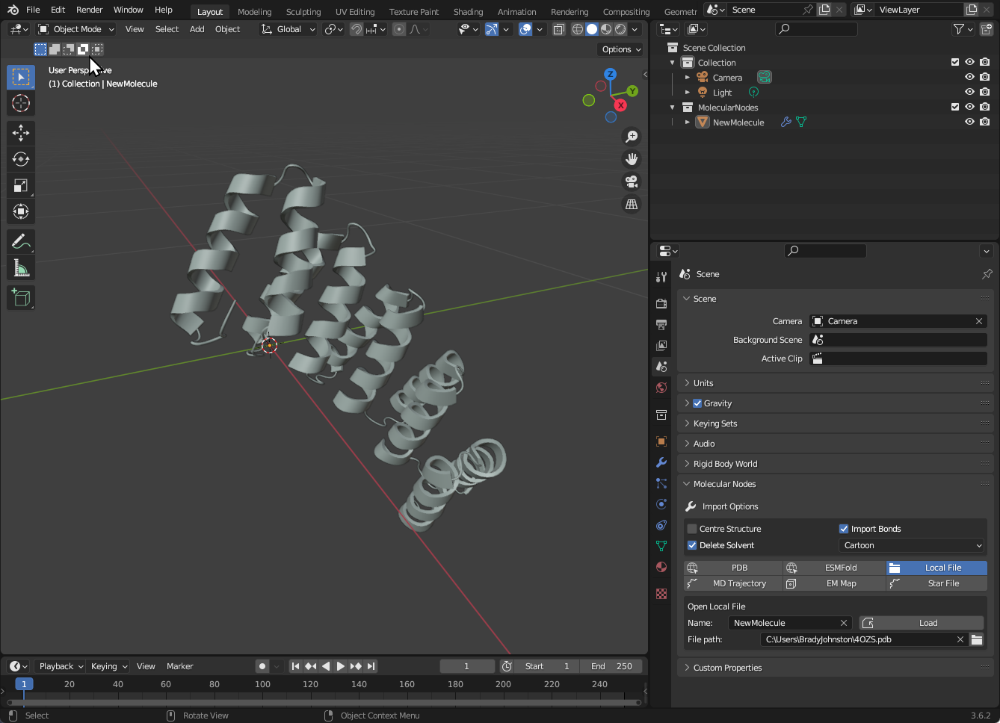

Molecules, simulations and other file formats can all be imported via the `Molecular Nodes` subpanel. This panel can be found under the `Scene Properties` panel. This is the small cone and spheres icon on the right. This contains all of the different options for importing molecular data currently available inside of Molecular Nodes.

## Downloading from the PDB

You can download a structure directly from the PDB, just from the accession code. Molecular Nodes will download the file as a `.mmtf` file and cache it locally on your computer, then open the file in to Blender. This is the quickest way to import structures that are already available via the wwPDB. Currently this downloads via the RCSB.

To download directly from the PDB, you can use the <kbd>PDB</kbd> tab.

### PDB Tab

In this tab you can input the PDB ID to be used for downloading the structure. You can also change where Molecular Nodes caches the downloaded structures. By default it will be in a hidden `.MolecularNodes` folder in your home directory.

Type in the code, choose your import options such as starting style, and click download. The new object will appear in the outliner. It will appear inside of the `MolecularNodes` collection and should have the name of the PDB ID used to fetch the structure. If an object already exists with that name, it will be appended with a `.001` or similar suffix.

In the example below, `6n2y` was downloaded, with the `Cartoon` starting style selected. No other default settings were changed.

## Open a Local File

To open a `.pdb`, `.mmCIF`, `.pdbx` or other similar files, use the <kbd>Local File</kbd> tab.

You can set the name for the molecule, which will become the object's name once imported. Use the folder icon to select the file you would like to import.

The 'Default Style' was changed to 'Cartoon', but no other default import options were changed. The Default Cube was deleted with <kbd>X</kbd> as the protein was imported *inside* of the cube.

