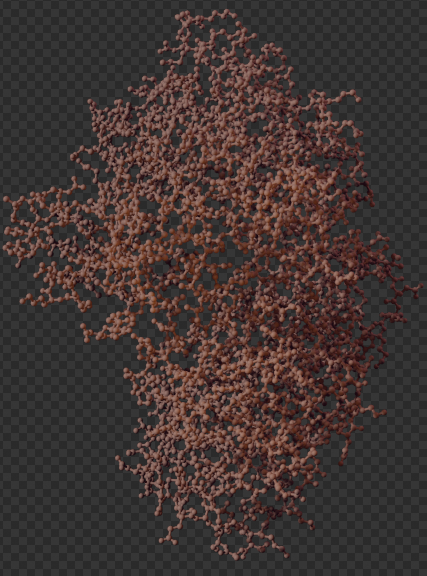

# Interface

The Molecular Nodes panel can be accessed in the scene properties tab.
This panel can additionally be accessed inside the 3D viewport's N-panel if enabled in the preferences of Molecular Nodes.

There are currently three methods for importing structures via Molecular Nodes into Blender.

You can download from the PDB with the PDB tab, open a local `.pdb` or `.mmcif` file with the `Local File` tab, or open a Molecular Dynamics trajectory on the `MD Trajectory tab`.

Each tab has a set of import options and fields to accept PDB IDs, names and file locations.

## PDB Tab

#### PDB ID:

Field for the 4-letter PDB ID to be input, and button to start the download and import process.

#### Calculate Bonds

Whether or not to try and calculate bond information on the structure during import.
Can be very slow for large structures, or if also building a biological assembly.
The `Cutoff` represents the same cutoff value that is used inside of the [PyMol bond detection](https://pymolwiki.org/index.php/Connect_cutoff).

#### Build Biological Assembly

Whether or not to build the biological assembly, such as the full virus capsid, from the symmetry information that is present inside of the file.
Assembly ID chooses which assembly information inside of the file to build from.

#### Nanometre Scale

Inside of structure files, the base unit is usually 1 Å, which will become 1 m inside of Blender and 1 nm will become 10 m.
To scale things down to a more manageable size we re-scale the structure so that 1 nm will become 1 m.

## Local File Tab

#### Name Field

An optional name to be given to the structure on import.

#### File Path

The path to the structure file to be opened.

#### Calculate Bonds

Whether or not to try and calculate bond information on the structure during import.
Can be very slow for large structures, or if also building a biological assembly.
The `Cutoff` represents the same cutoff value that is used inside of the [PyMol bond detection](https://pymolwiki.org/index.php/Connect_cutoff).

#### Build Biological Assembly

Whether or not to build the biological assembly, such as the full virus capsid, from the symmetry information that is present inside of the file.
Assembly ID chooses which assembly information inside of the file to build from.

#### Nanometre Scale

Inside of structure files, the base unit is usually 1 Å, which will become 1 m inside of Blender and 1 nm will become 10 m.
To scale things down to a more manageable size we re-scale the structure so that 1 nm will become 1 m.

## MD Trajectory Tab

#### Name Field

An optional name to be given to the structure on import.

#### Topology File Path

The file path to the toplogy file for import.
See the [table of supported topology formats](https://docs.mdanalysis.org/stable/documentation_pages/topology/init.html#supported-topology-formats) for the formats that should be importable by Molecular Nodes.

#### Trajectory File Path

The file path to the trajectory file for import.
See the [table of supported trajectory formats](https://docs.mdanalysis.org/stable/documentation_pages/coordinates/init.html#id2) for the formats that should be importable by Molecular Nodes.

#### Frame Import Options

-   Start Frame: The first possible frame from the coordinate file to be imported into Blender

-   Interval: Imports every *n* th frame from the trajectory.
    1 will import all frames from the trajectory.

-   End Frame: The last possible frame from the coordinate file to be imported into Blender.

#### Nanometre Scale

Inside of structure files, the base unit is usually 1 Å, which will become 1 m inside of Blender and 1 nm will become 10 m.
To scale things down to a more manageable size we re-scale the structure so that 1 nm will become 1 m.

# Nodes

## Original Setup

When importing a PDB structure, you get a set of interconnected nodes, of which two belong to this addon.

{fig-align="center"}

The MOL_style_color taking for input the geometry, meaning atom coordinates and properties (visible in the top left corner of your blender window). It allows different colors to be assigned based on the value of the atom type attribute. The output is a mesh of vertices (atoms) connected by edges (bonds) that can be converted to a curve.

You are free to modify this setup as you wish using the *Shift+A* shortcut and going to the Molecular Nodes tab, which contains a set of nodes detailed thouroughly here. 

## Properties

### Atomic Properties

The `MOL_prop_setup` node associates all of the different atomic properties with their corresponding atoms in the structure.

#### Required Inputs

-   **Atoms:** mesh vertices or point-cloud that are the `XYZ` locations of the atoms.

-   **Properties Collections:** The collection that contains the `NAME_properties_1` models that were imported alongside the structure.

#### Optional Inputs:

A boolean switch for each of the atomic properties.
By default the properties are enabled, but they can be disable if required to provide a slight performance improvement if not required.

#### Outputs

-   **Atoms (**mesh vertices or point-cloud)**:** that are the `XYZ` locations of the atoms, that also have *named attributes* for each of the atomic properties that were selected for set up.

-   **atomic_number** (integer field): integer number corresponding to the atomic number of the atom.
    Defaults to 0 if *atomic_number* cannot be determined.

-   **chain_number** (integer field): integer number corresponding to the chain that the atom belongs to.
    Chains will be sorted into alphabetical order, then given a corresponding integer number starting from 1.
    Defaults to 0 if *chain_number* cannot be determined.

-   **atom_name_number** (integer field): integer number corresponding to the name of the atom within the structure ("CA" for the alpha carbon).
    Defaults to 0 if *atom_name_number* cannot be determined.

-   **AA_sequence_number** (integer field): integer number corresponding to the sequence number of the amino acid in the structure that the atom belongs to.
    For LYS32 the *AA_sequence_number* will be 32.
    Defaults to 0 if *AA_sequence_number* cannot be determined.

-   **AA_name** (integer field): integer number corresponding to the different residue names.
    Amino acids are numbered 1-20 based on alphabetical order.
    See the `MOL_sel_AA_name` node for the corresponding order.

-   **atom_index** (integer field): integer number corresponding to the order of the atom within the structure file.

-   **B_factor** (float field): a float number corresponding to the value that was present in the B factor column, also known as the *temperature factor*.

-   **is_backbone** (boolean field): a boolean value (TRUE or FALSE, 1 or 0) as to whether or not the atom is part of the backbone of the protein.

-   **is_alpha_carbon** (boolean field): a boolean value (TRUE or FALSE, 1 or 0) as to whether or not the atom is an *alpha carbon* of the amino acid.

{fig-align="center"}

## Styling Nodes

### Style Ribbon

This node uses the `is_alpha_carbon` property and the `chain_number` properties to generate a ribbon-representation of the structure as a mesh.
Options are available for the radius, smoothness and the resolution of the ribbon.

#### Required Inputs

-   **Atoms** (mesh vertices or point cloud): atoms that contain at least the *is_alpha_carbon* named attribute and the *chain_number* attribute to ensure the ribbons are separated by chain.

#### Outputs

-   **Ribbon** (mesh): a mesh that is the ribbon representation of the structure.

-   **Curve** (spline / curve): a curve that goes through all of the alpha carbons in the structure, that is used to build the final ribbon mesh.

{fig-align="center"}

{fig-align="center"}

### Style Atoms

This node represents atom coordinates as point clouds (cycles, unrealized geometry) or icospheres (eevee, real geometry). Both can be set to have different radii and the eevee one can be set to a different sphere resolution.

#### Required Inputs

-   **Atoms** (mesh vertices or point cloud): atoms that include the *vdw_radii* attribute.

#### Outputs

-   **Atoms** : Visible spheres per instances of input atoms, depending on the render engine.

{fig-align="center"}

### Style Surface

This node represents the computed surface of the molecule, based on atom coordinates. The quality involves direct subdivision, for a richer geometry, scale radii boosts the influence of each atomon the rendered surface, probe size adds details, surface smoothing reshapes final geometry by blurring, thus averaging, positions.

#### Required Inputs

-   **Atoms** (mesh vertices or point cloud): atoms that include the *vdw_radii* attribute.

#### Outputs

-   **Surface** : Actual geometry surrounding the atoms.

-   **Volume** : Blender instance of volume density inside of the computed surface. Can be used to scatter points again, or with a specific shader.

{fig-align="center"}

### Style Ball and Stick

This node represents the usual molecular representation of molecules, with atoms as a ball and bonds as sticks. Both radii andresolution can be modified.

#### Required Inputs

-   **Atoms** (mesh vertices or point cloud): atoms that include the *vdw_radii*, *bond_types*, *pre_bond_index*, *atomic_number*, *res_name*, *chain_id*, *res_id* attributes.

#### Outputs

-   **Sticks** : Atom bonds visualised as a straight curve.

-   **Balls** : Atoms visualised as spheres.

-   **Ball and Stick Mesh** : The combination of the outputs shown above.

{fig-align="center"}

### Style Cartoon

The highly anticipated update :O

This node represents a common modern illustration of proteins, with alpha helix as a planar corskrew shape, and beta sheet as a stretched cuboid with a triangle-shaped polygon at the end, constituting an arrow.

Representations of helixes can be switched between corkskrew and cylinder, and each shape can be scaled and smoothed using either resolution or subdivisions.

Parameters can be changed locally using geometry nodes, see examples in the documentation/examples.md, and combined with other representations using Join Geometry.

#### Required Inputs

-   **Atoms** (mesh vertices or point cloud): atoms that include the *is_alpha_carbon* attribute.

#### Outputs

-   **Mesh** : Geometry containing the secondary structure representations.

{fig-align="center"}

### Preview

After each style node there is a preview of the default settings on a protein. You can combine further reprensentations to style it as you wish (which combination of nodes is the following representation?)

{fig-align="center"}
